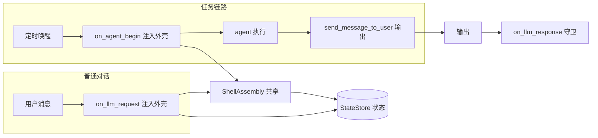

# 任务流程人格外壳集成 · 设计文档

> 版本：v1（设计稿，待评审 → 待实现）
> 关联：`DESIGN_proactive.md`（主动消息）、`PLAN_proactive.md`（开发计划）
> 状态：只读分析 + 设计方案，**不写代码、不改 AstrBot 主程序**

---

## 1. 背景与目标

### 1.1 背景

Firefly 是角色扮演插件，其核心资产是「认知外壳」：人格（Tier1）+ 心情 + 最近话题 + 激活资料。
当前外壳只在「用户发消息」这条路径上注入。AstrBot 的**任务系统**（定时提醒、未来可能的多步自动任务、甚至操控电脑）是另一条路径，这条路径上的若干环节**不会注入外壳**，导致：

- 任务触发时她「没有人格细节、没有心情、没有资料」；
- 任务结果输出的语域不稳定；
- 任务触发还会反过来污染 Firefly 的情绪状态（详见 §4）。

### 1.2 目标

让**整条主动任务流程**（创建 → 落库 → 触发 → 执行 → 输出 → 收尾）的每一个需要「她开口」或「她思考」的环节，都遵循人格认知外壳的约束。

### 1.3 非目标

- 不实现任务调度（复用 AstrBot `CronJobManager`）。
- 不实现多步编排 / 电脑操控（复用 AstrBot agent loop 与 computer use）。
- 不修改 AstrBot 主程序（只读其公开扩展点）。
- 本阶段不写代码，仅产出设计方案。

---

## 2. 硬约束（严格遵循）

1. **只做插件**：所有改动落在 `data/plugins/astrbot_plugin_Firefly/`，主程序一行不改。
2. **只用公开扩展点**：通过 `@filter.*` 插件钩子与配置项实现；读主程序只为确认触发时机与注入位置。
3. **能力探测 + 静默降级**：上游钩子签名、触发时机变化时，直接跳过，绝不抛异常、绝不阻断主流程。
4. **单一数据源**：情绪与状态只存 Firefly 的 `cognitive_state.json`，不污染 AstrBot 存储。
5. **core / adapter 分层**：`core/` 纯逻辑（不 import astrbot），`adapter/` 只做框架对接。
6. **边界完整**：并发、去重、空态、异常隔离、可观测均需显式设计（见 §8）。

---

## 3. 现状盘点（基于 AstrBot 实际代码）

### 3.1 插件可用的钩子全集

`astrbot/core/star/star_handler.py` 的 `EventType`（共 16 个）。与本设计相关且插件可订阅的：

`on_waiting_llm_request`、`on_llm_request`、`on_llm_response`、`on_agent_begin`、`on_agent_done`、`on_decorating_result`、`on_using_llm_tool`、`on_llm_tool_respond`。

### 3.2 关键触发时机（决定我们能用哪个钩子）

| 钩子 | 触发位置 | 普通对话 | 定时任务 |
|---|---|---|---|
| `on_llm_request` | `pipeline/.../agent_sub_stages/internal.py:277`、`third_party.py:307` | ✅ | ❌ |
| `on_agent_begin` | `agent/runners/tool_loop_agent_runner.py:807`（agent 首次执行、调 LLM 之前） | ✅ | ✅ |
| `on_using_llm_tool` / `on_llm_tool_respond` | `core/astr_agent_hooks.py:43-70` | ✅ | ✅ |
| `on_llm_response` / `on_agent_done` | `core/astr_agent_hooks.py:23-41` | ✅ | ✅ |
| `on_decorating_result` / `on_after_message_sent` | 流水线 result_decorate / respond 阶段 | ✅ | ❌ |

**规律**：挂在流水线阶段的钩子在任务路径**不触发**；挂在 agent hooks 上（跟着 runner 走）的钩子在**两条路径都触发**。

### 3.3 任务唤醒的现有流程

`astrbot/core/cron/manager.py`：

- `_run_active_agent_job`（:360）→ `_woke_main_agent`（:396）
- 组装 `req.system_prompt += PROACTIVE_AGENT_CRON_WOKE_SYSTEM_PROMPT.format(cron_job=...)`（:479-481），其中 `cron_job` JSON 含 `note` 字段 → **note 进入系统提示词（强通道）**
- `build_main_agent(...)`（:495）→ 该函数内部把 AstrBot 人格写进 `system_prompt`（`astr_main_agent.py:561`）
- `runner.step_until_done(...)`（:503-505）→ agent 多步循环
- 输出投递靠 agent 调用 `send_message_to_user` 工具，其内部 `context.send_message(...)` 直发（`tools/message_tools.py:339`），**绕过流水线**

### 3.4 Firefly 现有实现

- `on_llm_request` → `adapter/injector.py`：读状态 → 路由 → 合并激活上下文 → 组装外壳 → 注入 `req.extra_user_content_parts`
- 外壳最终位置：`provider/entities.py:190-206` —— 被拼成 **user 消息里、用户原话之后** 的内容块
- `on_llm_response` → `_update_state`：事件驱动更新心情、更新话题、衰减上下文；**若 `unanswered_count > 0` 则回灌 reunion 并清零**

---

## 4. 问题定位：两个真缺口

| 编号 | 问题 | 根因 | 后果 |
|---|---|---|---|
| **G1** | 任务「触发 + 执行」时不注入外壳 | 唤醒路径不经过 `on_llm_request`（流水线钩子） | 她只有框架人格，没心情/话题/资料 |
| **G2** | 任务「收尾」污染情绪状态 | `on_llm_response` 在任务路径也会触发，把 cron 的 `note` 当作用户消息，且在 `unanswered_count > 0` 时误判为「用户回复」 | 情绪被错误改写、未回复计数被错误清零 |

其余问题（输出语域、与主动消息统一）是「效果与整洁度」，不是缺口。

---

## 5. 设计原则

1. **以「缺口」为最小改动单位**：先解决 G1、G2，再做优化。
2. **显式区分路径，不靠模糊去重**：能识别「这是任务路径」时，就显式分支；识别不清时，靠「同构守卫」保证幂等。
3. **注入是幂等的**：无论哪条路径、哪个钩子先到，外壳最终恰好出现一次。
4. **任务路径保持克制**：任务唤醒是「她自己在行动」，不是用户说话，因此收尾侧只做最小必要更新（甚至不更新）。
5. **复用已有资产**：外壳组装（`ShellAssembly.build`）、去重标记（`SHELL_INJECTION_MARK`）、状态仓库（`StateStore`）、调试记录（`DebugRecorder`）全部复用，不新造。

---

## 6. 总体架构

- **输入侧**：两条路径各有一个注入口，共用同一个外壳组装组件与去重守卫。
- **输出侧**：任务输出由「外壳 + note 语域」自然引导（§7.3），必要时再上改写钩子。
- **收尾侧**：`on_llm_response` 增加「任务路径识别」守卫。

---

## 7. 详细设计

### 7.1 G1：任务执行时注入外壳（核心）

**方案**：新增 `@filter.on_agent_begin()` 处理器，在 agent 首次执行、调 LLM 之前，把外壳注入 `run_context.messages`。

依据（已核实）：

- `on_agent_begin` 在 `tool_loop_agent_runner.py:807` 触发，处于 `AgentState.IDLE`、首次 LLM 调用之前。
- 它经 `MainAgentHooks`（`astr_agent_hooks.py:14-21`）触发，**两条路径都生效**。
- `run_context.messages` 是真正发给模型的消息数组（`agent/run_context.py:12-19`），元素为 `Message(role=..., content=...)`，可直接追加。
- 事件可从 `run_context.context.event` 取得，用于取会话标识。

**守卫（与普通对话同构，保证幂等）**：注入前依次检查：

1. 配置总开关 `enabled`
2. 会话在白名单（`is_session_enabled`）
3. 资料已加载（`registry.is_loaded`）
4. **消息数组里已存在外壳标记 → 跳过**（普通对话路径已由 `on_llm_request` 注入过，避免双注入）

**与 `on_llm_request` 的分工**：

- `on_llm_request`（普通对话）：读状态 → 路由 → 合并激活上下文 → 组装 → 注入 → 持久化。保持现状不变。
- `on_agent_begin`（任务路径兜底）：只做「读状态 → 组装 → 注入」，**不做路由、不合并、不持久化**（任务唤醒不需要路由用户意图，持久化交给收尾侧）。

**注入位置（已由 P1-0 实测确定）**：追加到 `messages` 中**最前面的 system 消息**的内容末尾。

实测依据：`ContextTruncator.truncate_by_dropping_oldest_turns` 丢弃最旧轮次后，只恢复「原列表的第一条 user 消息」，因此注入到 user 消息会在压缩时丢失；而 system 消息由 `_split_system_rest` 单独保留，在全部压缩策略下都存活。另外 system 位置权威更高，更利于人设遵守。

**已实测确认的风险**：

- ✅ `run_context.messages` 在 `on_agent_begin` 触发前已由 `reset()` 构建完成（`tool_loop_agent_runner.py:323` 早于 `:807`）。
- ✅ 压缩策略（轮次截断 / LLM 摘要）均保留 system 与最近轮次，system 位置注入可存活。
- ⚠️ 若 `messages` 中不存在 system 消息（cron 路径不会发生），回退为插入 system 消息并记录降级原因。
- ⚠️ 消息数组结构异常（空、非预期 role、content 为列表）时需兜底，不得抛异常。

### 7.2 G2：任务收尾不污染情绪

**方案**：`on_llm_response` 增加「任务事件识别」，任务路径走「最小更新」分支。

识别方式（双保险）：

1. 首选：`event.platform_meta.name == "cron"`（`cron/events.py` 的 `CronMessageEvent` 用 `PlatformMetadata(name="cron")`）
2. 兜底：`event.get_extra("cron_job")` 存在（`_run_active_agent_job` 写入 extras）

**任务路径的最小更新策略（v1 建议：不更新情绪）**：

- 不回灌任何 `AffectEvent`（note 是她的指令，不是用户情绪）
- 不触发 `reunion`、不清零 `unanswered_count`
- 不更新 `last_user_at`（那不是用户）
- 可选：仅把 note 作为话题写入 `recent_topics`（便于后续对话有连续性）—— 标记为待决策，v1 默认不做，先观察。

若未来需要「任务也能影响心情」（例如她完成任务后有成就感），再作为独立的、显式的事件引入，不与用户对话事件混用。

### 7.3 输出侧：语域控制（R3/R8）

任务输出由 agent 生成并直发。控制语域的两条通道：

**通道 A（引导，首选）**：让生成端的提示词本身就带人设。

- 任务执行时已有外壳（7.1 落地后自动成立）
- `note` 进系统提示词（§3.3），是唤醒时的强通道 → **note 要写成「她打算怎么开口」**，而不是干巴巴的任务名

**通道 B（工具描述）**：把内置 `future_task` 换成插件自有工具。

- 内置工具描述是「Manage your future tasks…ISO datetime…」，把模型带进任务管理语域
- 插件自有工具的描述用她的口吻（如「把答应对方的事记在心里，到点替他想着」）
- 工具内部仍调 `context.cron_manager.add_active_job(...)`，**不重复造调度**
- 工具的 `note` 参数说明里明确「用第一人称写下你打算怎么开口，语气自然、不说教」
- 配套：在配置中关闭内置工具 `provider_settings.proactive_capability.add_cron_tools = false`

**通道 C（改写，兜底，暂缓）**：`on_using_llm_tool` 在工具执行前可改写参数。但改写点、参数是否生效需实测，且较脆，**默认不做**，仅在 A/B 实测不足时再评估。

### 7.4 可观测性

- `DebugRecorder` 增加「agent 注入」记录类型（或复用 `InjectionRecord` 增加来源字段），记录：路径（llm_request / agent_begin）、是否注入、跳过原因。
- `/firefly` 调试面板可查「本轮外壳是否注入、走哪条路径」。
- 所有跳过/降级必须有可观测原因，禁止静默失败。

### 7.5 与主动消息统一（R9，后置）

主动消息（情绪驱动）与任务（时间驱动）在「外壳组装」「投递」上是同一件事。当前主动消息已有 `ShellAssembly.build` + `context.send_message`。待两处各自稳定后，再考虑收口为两个薄接口：

- `build_persona_context(session_id) -> str`
- `deliver(session_id, text) -> None`

**本阶段不强制统一**（避免为抽象而抽象），仅在出现真实重复时收口。

---

## 8. 边界条件与并发（完整清单）

| 边界 | 处理 |
|---|---|
| 普通对话两条钩子都触发（双注入） | 去重守卫：消息数组存在标记即跳过 |
| 会话被禁用 / 不在白名单 | 两条路径同构守卫，均不注入 |
| 资料未加载 | 跳过并记录 `empty_registry` |
| 无 Provider / 生成失败 | 跳过，不影响其它环节 |
| cron 事件误判（platform 名未来变化） | 双保险识别（platform_meta + extras） |
| `run_context.messages` 为空或结构异常 | 类型/空检查，异常整体捕获并记录 |
| 压缩吃掉外壳 | 外壳尺寸受 `ShellBuilder` 预算约束；实测验证存活位置 |
| 钩子签名变化（上游升级） | 每个处理器整体 try/except，静默降级 + 可观测 |
| 任务路径不路由、不合并不持久化 | 明确：这是有意的，收尾侧做最小更新 |
| 并发（同会话多次 agent 运行） | `StateStore` 自带锁，短操作持锁、不跨 LLM 持锁；注入本身无共享可变状态 |
| note 为空 / 异常 | 组装时兜底，不因 note 异常中断 |
| 关闭内置工具后模型仍尝试调用 | 自有工具描述引导 + 可观测记录，不阻断 |

---

## 9. 配置与工具变更

| 变更 | 类型 | 说明 |
|---|---|---|
| 新增 `inject_on_agent_begin`（默认 true） | 插件配置 | 任务路径注入开关，便于回退 |
| 新增 `firefly_reminder`（`@llm_tool`） | 插件代码 | 语域控制的提醒工具 |
| 关闭内置 `future_task` | AstrBot 配置（非代码） | 避免两套工具并存 |

---

## 10. 测试计划

core 层（纯逻辑，可独立单测）：

- 守卫逻辑：各跳过条件的真值表（enabled / session / registry / 已注入）
- 去重：已存在标记时二次注入被正确跳过

adapter 层（沿用现有 Fake 风格）：

- `on_agent_begin` 注入：正常注入、已注入跳过、禁用跳过、空资料跳过、异常隔离
- `on_llm_response` 任务路径：cron 事件不误判 reunion、不清 unanswered、不影响 mood
- 识别双保险：仅 platform_meta 命中、仅 extras 命中、两者都不命中，三种情形
- 注入后消息数组长度/顺序符合预期

回归：

- 现有 89 个用例全绿（尤其 injector 普通对话路径行为不变）

---

## 11. 分阶段实施

| 阶段 | 内容 | 验收 |
|---|---|---|
| **P0** | G2：`on_llm_response` 任务事件守卫 | cron 事件不污染情绪；现有测试全绿 |
| **P1** | G1：`on_agent_begin` 注入 + 去重守卫 + 可观测 | 任务路径注入外壳、普通对话不双注入 |
| **P2** | 输出语域：自有 `firefly_reminder` 工具 + 关闭内置工具 + note 规范 | 创建/触发两阶段语气可控 |
| **P3** | 收口：主动消息与任务共用外壳/投递接口 | 仅当出现真实重复时执行 |

依赖：P0 独立；P1 是后续一切的地基；P2 依赖 P1。

---

## 12. 风险与取舍

| 风险 | 取舍 |
|---|---|
| 依赖 AstrBot 公开钩子的触发时机，上游可能变 | 能力探测 + 静默降级 + 可观测；接受「上游改了我们就失联，但不会崩」 |
| `on_agent_begin` 注入可能被上下文压缩裁掉 | 实测验证；必要时调整注入位置/尺寸 |
| 任务路径收尾「不更新情绪」可能被期望「任务也影响心情」 | 先克制，明确这是 v1 决策，未来以显式事件扩展 |
| 自有工具 vs 内置工具并存期的语域混乱 | 上线即关闭内置工具，不留并存窗口 |
| 输出侧「引导」不完全可控 | 接受自然性 > 确定性；必要时再上改写钩子 |

---

## 13. 待决策点

1. 任务触发是否要受「免打扰时段 / 情绪」约束？（当前 AstrBot 到点必发）
2. 任务路径收尾是否要把 note 写入 `recent_topics`？（v1 默认不做）
3. 输出侧是否接受「仅引导」方案，还是坚持要「改写」兜底？
4. 是否立即关闭内置 `future_task` 并上线自有工具？

---

## 14. 一句话总结

> **缺口只有两个：任务「执行时没有外壳」（G1）、任务「收尾时污染情绪」（G2）。**
> G1 靠 AstrBot 公开的 `on_agent_begin` 钩子（两条路径都触发、调 LLM 之前、可改最终消息数组）解决；G2 靠任务事件识别 + 最小更新解决。
> 其余是语域控制（工具描述 + note）与统一收口，全部在插件内、通过公开扩展点实现，**一行主程序都不用改**。
