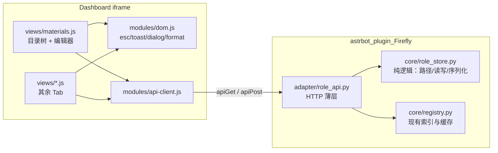

# 调试面板改造 + role 资料可视化编辑 · 设计文档

> 版本：v1（设计稿，待实现）
> 关联：`DESIGN_task_shell.md`（任务外壳）、`README.md`（资料格式说明）
> 状态：只读分析 + 设计方案。**不写代码、不改 AstrBot 主程序。**
> 范围：仅 `data/plugins/astrbot_plugin_Firefly/`；编辑对象仅 `role/` 目录。

---

## 1. 背景与目标

### 1.1 背景

Firefly 的调试面板（`pages/dashboard/`）目前是只读工具：

- 前端为单文件巨石：`app.js`（478 行 IIFE）+ 写死暗色的 `styles.css`（`styles.css:2-21`）；
- 「资料浏览」Tab 只列出 registry 已收录的条目，无法编辑；
- 新增/修改角色资料必须手工改磁盘文件，且没有格式校验。

`role/` 是插件的核心资产（86 个 `.md`，根目录 1 个 + 4 个顶层目录，其中 `世界知识/派系/` 下还有三级子目录）。用户需要一个可视化编辑器，直接完成资料的增删改查。

### 1.2 目标

1. **视觉改造**：支持 AstrBot 明/暗双主题，统一设计 token，重塑「资料浏览」为两栏资料管理器。不受原页面结构限制，允许整体重做。
2. **资料 CRUD**：在 `role/` 内提供文件级「增 / 删 / 改 / 查（目录树）」，含结构化表单 + 全文编辑。
3. **边界可控**：写操作是本插件引入的第一项"用户可控磁盘写"，必须显式约束路径、并发、数据保真与失败回滚。

### 1.3 非目标

- 不实现 Markdown 富文本所见即所得（仅纯文本编辑，预览为可选后置项）。
- 不编辑 `role/` 以外的任何文件；不改 `adapter/proactive_prompt.py` 等代码内提示词模板。
- 不引入前端构建链（Vue/Vite/打包器），保持静态直出 + 原生 ES Module。
- 不新增 AstrBot 主程序代码，只使用公开扩展点（`register_web_api` 与 plugin page bridge）。

---

## 2. 已确认决策（评审输入）

| # | 决策 | 结论 |
|---|---|---|
| D1 | Tab 归属 | **合并进现有「资料浏览」Tab**，但整体重做 UI，不受原结构限制 |
| D2 | 删除策略 | **硬删除**（不可恢复），配强确认守卫（见 §7.3） |
| D3 | 编辑形态 | 允许**全文编辑**；同时提供结构化控件：`type`/`kind`/`tier` 下拉框，`id`/`title`/`priority`/`default_ttl` 输入框，`keywords`/`tags`/`patterns` 标签输入 |
| D4 | 主色 | 改为**萤火青绿**（主色 `#5ce1c4`），保留紫色作为 `kind` 辅助徽标色 |
| D5 | 编辑范围 | **仅 `role/`** 目录内的 `.md` 文件 |

---

## 3. 硬约束（严格遵循）

1. **只做插件**：所有改动落在 `data/plugins/astrbot_plugin_Firefly/`，主程序一行不改。
2. **core / adapter 分层**：`core/role_store.py` 纯逻辑（不 import astrbot，不 import quart）；`adapter/role_api.py` 只做 HTTP 参数提取与响应封装。
3. **单一数据源**：文件系统是唯一事实来源；registry 仅用于元数据增强，不作为写对象。
4. **不触碰既有只读接口**：`adapter/debug_api.py` 保持只读语义，不修改。
5. **失败不破坏现状**：写失败不触碰原文件；`registry.reload()` 失败保留旧索引（`registry.py:108-111`）。
6. **能力探测 + 静默降级**：`register_web_api` 不存在时跳过注册（沿用 `main.py:316-320` 的做法）。

---

## 4. 现状盘点（基于实际代码）

### 4.1 前端

| 文件 | 现状 | 问题 |
|---|---|---|
| `pages/dashboard/index.html` | 6 个 Tab（`index.html:23-30`），`materials` 为只读列表 | 需重做为两栏管理器 |
| `pages/dashboard/styles.css` | 写死暗色 token（`:2-21`），`--accent: #7c8aff` | 完全不响应 `data-theme` |
| `pages/dashboard/app.js` | 单文件 IIFE，字符串拼 HTML + `onclick="FF.x"` | 巨石；存在 XSS 隐患（`:223-226`、`:300`、`:332` 未转义的 id/session_id） |
| `pages/dashboard/modules/api-client.js` | 封装 `bridge.apiGet/apiPost` | 可扩展 |

### 4.2 后端

| 文件 | 现状 |
|---|---|
| `adapter/debug_api.py:94-122` | 在 `/{plugin_name}/page/*` 注册 20 个只读路由，返回 `{status, data}`（`:22-43` 的 `ok()/error()`） |
| `core/registry.py:78-119` | 全量扫描 `role/`，Tier1/2 立即加载，Tier3/4 懒加载 + LRU |
| `core/registry.py:20-46` | tier/kind 按目录名/文件名自动推断 |
| `core/registry.py:243-248` | ID 冲突时保留先加载者并告警（丢弃后加载的文件） |
| `core/registry.py:100-102` | 正文为空的文件被跳过并告警 |
| `core/parsers.py:44-69` | 极简 frontmatter 解析：仅 `key: value` / `key: [a, b]`，无引号转义 |
| `core/consts.py:42-56` | 目录 → tier/kind 规则；`:105` 忽略 `_`/`.` 前缀 |
| `main.py:82` | 角色资料根目录硬编码为 `plugin_dir / "role"` |

### 4.3 AstrBot 页面与桥接机制（只读确认）

| 机制 | 位置 | 对本设计的影响 |
|---|---|---|
| 页面发现 | `plugin_page_service.py:508-538` | `pages/<name>/index.html` 约定；相对资源 URL 会被重写 |
| JS import 重写 | `plugin_page_service.py:778-838` | 支持 `views/*.js` 的 ES Module 相对导入，无需构建 |
| 主题注入 | `plugin_page_service.py:115-155` + `plugin_page_bridge.js:125-144` | bridge 在 `<html>` 上设 `data-theme="dark/light"`，并广播 `isDark` |
| Bridge API | `plugin_page_bridge.js:207-285` | 仅 `apiGet` / `apiPost` / `upload` / `download` / `subscribeSSE`，**没有 PUT/DELETE** |
| 请求代理 | `dashboard/src/views/PluginPagePage.vue:122-125` | endpoint 映射为 `/api/v1/plugins/extensions/{pluginName}/{endpoint}` |

**结论**：增删改必须全部映射为 `apiPost`；前端主题由 CSS 变量 + `:root[data-theme]` 实现。

### 4.4 一个必须纠正的认知

`consts.py:12` 定义了 `FM_KEY_TYPE = "type"`，但 `registry._load_entry()` **从不读取该字段**；运行时行为由 `tier`（是否常驻/懒加载）与 `keywords`/`patterns`（路由）、`default_ttl`（激活保持）决定。

因此 UI 必须把 `type` 标注为**兼容/展示字段**，不能让用户误以为改它会影响激活行为。结构化表单中仍保留下拉框（D3），但附提示"当前运行时由 tier 与 keywords 决定行为"。

---

## 5. 总体架构



- **`core/role_store.py`**：无框架依赖、纯函数式/小类，可直接用 `tempfile` 单测（对齐 `tests/test_loader.py` 风格）。
- **`adapter/role_api.py`**：复用 `debug_api.py` 的 `ok()/error()`；构造时注入 `registry`，在写/删后立即 `registry.reload()` 并回传告警。
- **不改 `debug_api.py`**：只读语义保持独立；`main.py` 在 `_register_debug_api` 旁并列注册 `RoleApi`。
- **前端保持原生 ES Module**：静态直出，`views/` 子目录通过相对 import 加载（AstrBot 会重写）。

---

## 6. 后端 API 契约

统一前缀 `/{plugin_name}/page/role`（`api-client.js` 自动拼 `page/`）。全部返回 `{status, data}` / `{status:"error", message}`。

| 方法 | 路由 | 用途 |
|---|---|---|
| GET | `role/tree` | 目录树 + 全部 `.md` 元数据（含"未收录"标记） |
| GET | `role/file` | 单文件：raw / frontmatter / body / unknown_keys / rev |
| POST | `role/save` | 新建或覆盖（`create` 标志），带乐观锁 |
| POST | `role/delete` | 硬删除（带二次守卫参数） |

### 6.1 `GET role/tree`

查询参数：`include_hidden`（默认 0）。

```json
{
  "dirs": ["", "技能", "人物关系", "世界知识", "世界知识/派系"],
  "entries": [{
    "path": "世界知识/派系/毁灭命途/绝灭大君.md",
    "name": "绝灭大君.md",
    "dir": "世界知识/派系/毁灭命途",
    "size": 1873,
    "mtime": 1758000000.0,
    "rev": "a1b2c3d4e5f6",
    "id": "faction_destruction_lords",
    "title": "派系·绝灭大君",
    "tier": 4,
    "kind": "lore",
    "type": "on_demand",
    "priority": 6,
    "default_ttl": 2,
    "tags": [],
    "keywords": ["绝灭大君", "毁灭"],
    "status": "registered"
  }],
  "warnings": [],
  "counts": {"1": 2, "3": 20, "4": 64}
}
```

`status` 取值：

| 值 | 含义 | 来源 |
|---|---|---|
| `registered` | 已被 registry 收录 | 正常 |
| `empty_body` | 正文为空，registry 跳过 | `registry.py:100-102` |
| `duplicate_id` | ID 冲突，本文件被丢弃 | `registry.py:243-248` |
| `read_error` | 文件读取失败 | `registry.py:214-217` |
| `hidden` | `_`/`.` 前缀，registry 不扫描 | `consts.py:105` |

> **关键决策**：树以**文件系统为准**，registry 仅做元数据增强。CRUD 操作对象是文件，而 registry 会静默丢弃"空正文 / ID 冲突 / 读失败"的文件——这些恰恰是用户最需要看到并修复的。

### 6.2 `GET role/file?path=...`

```json
{
  "path": "技能/讲笑话.md",
  "rev": "a1b2c3d4e5f6",
  "mtime": 1758000000.0,
  "size": 912,
  "frontmatter": {"id":"skill_joke","title":"讲笑话","kind":"skill","tier":3,
                  "type":"on_demand","keywords":["笑话"],"priority":60,"default_ttl":4},
  "unknown_keys": ["custom_field"],
  "body": "## 触发场景\n…",
  "raw": "---\nid: skill_joke\n---\n\n## 触发场景\n…"
}
```

- `frontmatter` 只含已知键（`consts.py:7-19` 的 `FM_KEY_*`）。
- `unknown_keys` 列出未知键名，前端在"原始全文"模式下可见；结构化模式保存时**原样保留**。
- `raw` 为磁盘原文，供全文编辑模式直接使用。

### 6.3 `POST role/save`

```json
{
  "path": "技能/讲笑话.md",
  "create": false,
  "base_rev": "a1b2c3d4e5f6",
  "frontmatter": {"id":"skill_joke","title":"讲笑话","kind":"skill","tier":3,
                  "type":"on_demand","keywords":["笑话"],"priority":60,"default_ttl":4},
  "body": "## 触发场景\n…",
  "raw": null
}
```

- `raw` 非空时进入全文模式：服务端解析 `raw` 得到 frontmatter/body，再按**服务端权威**校验并写回（不直接落 `raw` 字符串）。
- 响应：

```json
{
  "path": "技能/讲笑话.md",
  "rev": "f6e5d4c3b2a1",
  "mtime": 1758000123.0,
  "reload": {"total": 86, "tier_counts": {"1":2,"3":20,"4":64}, "warnings": []}
}
```

### 6.4 `POST role/delete`

```json
{"path": "技能/讲笑话.md", "base_rev": "a1b2c3d4e5f6", "confirm_name": "讲笑话.md"}
```

- `confirm_name` 必须与文件名完全一致（硬删除的显式确认，见 §7.3）。
- 响应：`{"path": "...", "deleted": true, "reload": {...}}`。

### 6.5 不做 reload 接口

写入/删除成功后由服务端自动 `registry.reload()` 并在响应中回传告警，前端无需额外请求。已有 `materials/reload` 保留用于手动热重载。

---

## 7. 边界控制（本方案重点）

### 7.1 路径边界

| 威胁 | 对策 |
|---|---|
| `../../config.json` | `(root/rel).resolve().relative_to(root.resolve())` 必须成功，否则拒绝 |
| 绝对路径 / `C:\` / UNC `\\srv` | 拒绝含 `:` 的段；拒绝以 `/`、`\` 开头 |
| `..`、空段、`.` | 逐段校验，段级白名单 `^[\w\u4e00-\u9fff\- ]{1,64}$` |
| Windows 保留名（CON/PRN/AUX/NUL/COM1…） | 白名单外一律拒绝 |
| Unicode 规范化绕过 | 先 `unicodedata.normalize("NFC", seg)` 再校验与比较 |
| 符号链接逃逸 | `resolve()` 后做相对性校验，并逐级检查父目录非 symlink |
| 扩展名滥用 | 文件仅允许 `.md`；目录无扩展名 |
| 深度/数量 | 路径深度 ≤ 8；单目录文件数 ≤ 500 |
| 隐藏前缀 | `_`/`.` 前缀：可读可展示，**拒绝写入**（与 `consts.py:105` 一致） |

### 7.2 写入边界

| 项 | 决策 |
|---|---|
| 原子性 | 先写同目录临时文件，再 `os.replace` 原子替换（Windows 同盘可用） |
| 编码 | UTF-8、无 BOM、`\n` 换行（解析器已 `lstrip("\ufeff")`，`parsers.py:49`） |
| 大小 | 单文件正文 ≤ 256 KiB，超限拒绝 |
| 阻塞 | `asyncio.to_thread` 包装磁盘 IO，避免阻塞事件循环 |
| 空正文 | 拒绝保存（对齐 `registry.py:100-102`，避免造出运行时不可见的条目） |
| 并发 | `rev = sha256(raw)[:16]`；`save`/`delete` 必带 `base_rev`，不匹配返回"文件已被外部修改，请刷新" |

### 7.3 硬删除的安全守卫（D2）

硬删除不可恢复，因此叠加三重守卫，但不改变"硬删除"这一语义：

1. **乐观锁**：`base_rev` 必须匹配磁盘现值。
2. **显式确认**：`confirm_name` 必须与文件名逐字符相同（前端弹窗要求用户输入文件名）。
3. **活跃提示**：删除前查询各会话 `active_context`，若该 `id` 正被激活，在确认弹窗中列出"N 个会话正在使用该条目"，用户需再次确认。

**残余风险（明确接受）**：删除后无备份、无法通过 UI 恢复。`role/` 若纳入 git 管理，可由版本控制兜底；文档与 UI 均不做额外回收站。

### 7.4 数据完整性边界

**frontmatter 保真**是编辑器反复写文件时的最大风险。`parsers.py` 是自研极简解析器，不具备 round-trip 能力，需配套改造：

| 变更 | 位置 | 说明 |
|---|---|---|
| 标量引号剥离 | `core/parsers.py` `_parse_value` | 成对 `"…"` / `'…'` 去掉引号并转义（当前会把引号留在字符串里） |
| 规范化序列化器 | `core/role_store.py` | 已知键按固定顺序输出；含 `:` `#` `[` `]` 或首尾空格的值加双引号并转义 |
| 未知键保留 | `core/role_store.py` | 从原文件按原行保留未知键，不被丢弃 |
| round-trip 测试 | `tests/test_role_store.py` | 写入 → 读取 → 字段完全一致 |

- **服务端权威**：无论前端提交结构化字段还是 `raw`，服务端都重新解析、规范化、序列化后落盘；不直接信任前端生成的文本。
- **ID 唯一性**：保存前在 registry 全量索引中查重（排除自身路径），冲突直接拒绝，不让 registry 去"保留先加载的版本"。
- **ID 规则**：`^[A-Za-z0-9_\-\u4e00-\u9fff]{1,64}$`；留空时按文件名 stem 生成（与 `registry.py:230` 一致），但仍参与唯一性校验。
- **tier/kind 推断提示**：未显式填写时，服务端按 `core.registry._infer_tier_kind`（`registry.py:20-46`）规则返回推断结果，UI 显示"由目录推断，可覆盖"。

### 7.5 一致性边界

- 写/删后立即 `registry.reload()`；`reload()` 失败会保留旧索引（`registry.py:108-111`），并原样返回 `warnings` 供前端横幅展示。
- 删除后各会话可能残留悬挂 `ActivatedEntry`：运行时无害（`registry.fetch` 会跳过缺失 ID），由 §7.3 的活跃提示覆盖。
- 前端切换文件 / 关闭页面时拦截未保存改动（`beforeunload` + 应用内确认）。
- 权限沿用 Dashboard 会话鉴权（bridge 仅在已登录页面可用）；服务端记录操作者与路径用于审计。

---

## 8. 前端架构

### 8.1 目录结构

```
pages/dashboard/
├── index.html            # 仅骨架 + Tab 容器（保留 bridge-sdk 显式引用）
├── styles.css            # 分节：tokens / 基础 / 组件 / 各视图
├── app.js                # 仅 Tab 注册、视图调度、启动
├── modules/
│   ├── api-client.js     # 扩展 role.* 方法
│   └── dom.js            # esc / byId / on / toast / confirmDialog / formatBytes / formatTime
└── views/
    ├── injections.js
    ├── state.js
    ├── route.js
    ├── materials.js      # 重做：目录树 + 编辑器
    ├── preview.js
    └── stats.js
```

**拆分理由**：6 个视图 + 编辑器，单文件远超可维护阈值（属 AGENTS「极端复杂度」可拆分情形）；同时消除 `esc`/`toast` 的重复实现与字符串拼 HTML。

### 8.2 统一约定

- **禁止 `onclick="FF.x"` 字符串注入**：改用 `data-*` + 事件委托 + DOM API 构建节点，从根上消除 XSS（现有隐患见 `app.js:223-226`、`:300`、`:332`）。
- 每个视图模块导出 `mount(container)` 或 `render()`，由 `app.js` 按 Tab 懒调用；Tab 切换只切换可见性与触发加载。
- `api-client.js` 在通用 `get/post` 之上增加语义方法：`roleTree()`、`roleFile(path)`、`roleSave(payload)`、`roleDelete(payload)`。

### 8.3 资料管理器交互

**左栏（目录树）**

- 按顶层目录分组的可折叠树，缩进导引线；
- 搜索框（匹配路径 / id / title / tags）、`tier`/`kind` 过滤、「显示隐藏文件」开关；
- 节点徽标：`T1~T4`、`kind`、`已收录` / `空正文` / `ID冲突` / `读失败`；
- 顶部「新建文件」按钮：先选目录、再输入文件名，创建后立即进入编辑。

**右栏（编辑器）**

- 顶部面包屑路径 + 状态徽标（`rev`、`mtime`、注册状态）；
- 结构化字段区（D3）：
  - 下拉框：`type`（static/on_demand，附"当前运行时由 tier 与 keywords 决定"提示）、`kind`（persona/skill/lore/narrative）、`tier`（1/3/4，附"由目录推断，可覆盖"）；
  - 输入框：`id`、`title`、`priority`（数字）、`default_ttl`（数字）；
  - 标签输入：`keywords`、`tags`、`patterns`（回车/逗号成标签，可删除）；
- 正文编辑区：等宽 textarea；
- 「原始全文」折叠模式：直接编辑完整文件，保存时由服务端解析并规范化；
- 工具栏：保存 / 撤销 / 删除；脏标记圆点；`Ctrl+S` 保存；
- 冲突横幅：`base_rev` 不匹配时提示"文件已被外部修改"，提供"重新加载"；
- 删除：二次确认弹窗，要求输入文件名，并按需展示活跃会话数。

---

## 9. 视觉方案

### 9.1 主题与 token

- `:root` 保留现有暗色为默认值，新增 `:root[data-theme="light"]` 覆盖；全部颜色走 CSS 变量，响应 bridge 注入的 `data-theme`（`plugin_page_bridge.js:125-144`）。
- 新增间距与结构 token：`--sp-1..5`、`--radius-sm/md/lg`、`--shadow-1/2`、字号阶梯、`--transition`。
- 组件统一：`.panel`、`.field`、`.badge`、`.btn`（primary/ghost/danger/sm）、`.tree`、`.editor`、`.dialog`、`.empty`、`.skeleton`；清除散落的 inline style。

### 9.2 主色（D4）

| 变量 | 暗色 | 亮色 | 用途 |
|---|---|---|---|
| `--accent` | `#5ce1c4` | `#0f9e86` | 主操作、选中态、强调 |
| `--accent-glow` | `rgba(92,225,196,.16)` | `rgba(15,158,134,.12)` | 背景高亮 |
| `--kind` | 保留紫色系 | 同左 | `kind` 徽标（与主色区分） |
| `--success/warning/danger` | 沿用现有语义色 | 同左 | 状态语义 |

### 9.3 布局与状态

- 吸顶 header + Tab；资料管理为两栏 master-detail，窄屏（<900px）时树折叠为抽屉/下拉。
- 无数据、加载中（skeleton）、错误均有明确状态；toast 支持堆叠。
- 可访问性：`focus-visible` 描边、Tab 与树节点加 ARIA role、`Esc` 关闭弹窗、`prefers-reduced-motion` 适配。

---

## 10. 分阶段实施

| 阶段 | 内容 | 验收 |
|---|---|---|
| **P0** 前端重构（无行为变化） | 抽 `modules/dom.js`；拆 `views/*`；引入 token + 明暗主题；修复既有 XSS 拼串 | 6 个 Tab 行为与现状一致；浅/暗色跟随 Dashboard 切换 |
| **P1** 只读树 | `core/role_store.py` 的 `list_tree` / `read_document`；`adapter/role_api.py` 的 `role/tree`、`role/file`；前端两栏树+详情 | 能列出全部 `.md`（含空正文/ID 冲突标记）；与旧 `materials` 接口结果对账一致 |
| **P2** 写路径 | `save` / `delete` + §7 全部边界控制 + 服务端序列化器 + 自动 reload；前端结构化表单与全文模式 | 增删改后 registry 立即反映；路径穿越/冲突/超限/rev 不符全部被拒并给出明确错误；硬删除需三重确认 |
| **P3** 打磨（可选） | Markdown 预览、文件重命名/移动、删除时活跃会话提示的强化 | — |

依赖：P0 独立；P1 是 P2 的地基；P2 完成即满足需求主体。

---

## 11. 测试计划

`tests/test_role_store.py`（纯逻辑，沿用现有 unittest 风格）：

- **路径边界**：`../x`、`/abs`、`C:\x`、`\\srv`、`a/../../b`、含 NUL、Unicode 保留名 → 全部拒绝
- **扩展名与隐藏前缀**：非 `.md` 拒绝；`_`/`.` 前缀可读不可写
- **大小与深度**：超 256 KiB、深度 > 8 → 拒绝
- **并发**：`rev` 不匹配 → 拒绝
- **ID 唯一性**：与现有文件重复 → 拒绝；留空按文件名生成
- **空正文**：拒绝保存
- **序列化 round-trip**：含 `:` `#` `[` `]` 引号 的值读写一致；未知键保留
- **原子性**：写入过程不产生半文件；失败不修改原文件
- **树构建**：覆盖 `empty_body` / `duplicate_id` / `read_error` / `hidden` 四类标记

`tests/test_parsers.py`（或在 `test_loader.py` 内扩充）：

- 标量引号剥离与转义解析

回归：现有 `tests/`（loader / matcher / injector / builder / affect / state / proactive）全绿。

前端无测试框架，采用手工清单（Tab 切换、主题跟随、脏数据拦截、删除确认、冲突横幅）。

---

## 12. 风险与取舍

| 风险 | 取舍 |
|---|---|
| 自研 frontmatter 解析器无法 round-trip | 先改解析器 + 序列化器 + round-trip 测试，再开放写接口（P2 前置） |
| 硬删除不可恢复（D2） | 三重确认 + 依赖 git 兜底；明确接受残余风险 |
| `type` 字段对运行时无效果 | UI 标注为展示字段并提示真实行为由 tier/keywords 决定 |
| 新顶层目录回退 Tier3/lore（`registry.py:42-45`） | UI 明示"由目录推断，可覆盖"，允许 frontmatter 显式指定 |
| 删除后会话残留悬挂激活项 | 删除前展示活跃会话数；运行时会自动跳过缺失 ID |
| 上游页面/bridge 机制变化 | 能力探测 + 静默降级；失败时面板不可用但不影响插件主流程 |
| 前端无构建链，代码组织靠约定 | 用 `views/` + `modules/` 明确边界，禁字符串拼 HTML |

---

## 13. 一句话总结

> 在**不改主程序、不引构建链、只动 `role/`** 的前提下，用 `core/role_store.py`（纯逻辑）+ `adapter/role_api.py`（HTTP 薄层）提供文件级 CRUD，
> 以「文件系统为准 + registry 增强」的目录树暴露全部资料（含被 registry 丢弃的文件），
> 以路径白名单、原子写、`rev` 乐观锁、ID 唯一性与 round-trip 保真构成边界；
> 前端把「资料浏览」整体重做为两栏资料管理器，支持结构化字段（下拉/输入/标签）与全文编辑，并采用萤火青绿主色 + 明暗双主题。
