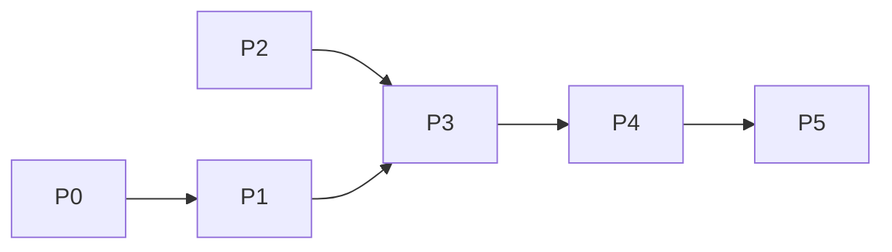

# 流萤主动消息 · 开发计划

> 对应设计文档：`DESIGN_proactive.md`
> 原则：**每个阶段独立可合并、独立可测试**，前序阶段不回归现有功能，后续阶段不推倒重来。
> 每个任务标注：目标 / 涉及文件 / 依赖 / 验收标准 / 风险。

---

## 0. 阶段总览

| 阶段 | 名称 | 产出 | 依赖 | 是否可独立合并 |
|---|---|---|---|---|
| P0 | 情绪引擎（纯逻辑） | `core/affect.py` | 无 | 是（新增，零侵入） |
| P1 | 状态模型 + 决策层 | `SessionState` 扩展、`ProactiveConfig`、`core/proactive.py` | P0 | 是（纯逻辑，未接入） |
| P2 | 外壳组装复用 | `ShellAssembly` | 无（可并行） | 是（重构，行为不变） |
| P3 | 执行器 + 接入 | `proactive_runner` / `proactive_prompt` / 配置 / 命令 | P1 + P2 | 是（手动触发可用） |
| P4 | 情绪闭环 | 用户回复回灌 | P3 | 是（闭环完整） |
| P5 | 加固与可观测 | 每日上限 / 分段 / dashboard / 全量回归 | P4 | 是 |

依赖关系：



> P0 与 P2 互不依赖，可并行开发。P1 仅依赖 P0 的 `MoodProfile`（情绪档案），不依赖 P0 的接入改造。

---

## 1. P0 情绪引擎（纯新增，零侵入）

### P0-1 新增 `core/affect.py`

- **目标**：建立统一的事件驱动情绪引擎，供"用户对话"与"主动消息"两条链路共用。
- **内容**：
  - `AffectEvent`（`kind` + `weight`）
  - `MoodProfile`（`mood` / `rate` / `threshold` / `half_life_hours` / `default_intent` / `reaction`）
  - 内置情绪档案表（想念、不安、委屈、开心、平静、疲惫、生气）
  - `AffectEngine`：`tick()`（半衰期衰减）、`apply()`（事件→心情，含惯性阈值、反向打断、回落基线）、`profile()`、`text_to_event()`（词典→事件启发式，承接 `_MOOD_LEXICON`）
- **涉及文件**：新增 `core/affect.py`；参考 `core/updaters.py` 的 `_MOOD_LEXICON` 与 `is_stale`。
- **依赖**：无。
- **验收**：纯函数、无 astrbot 依赖；单测覆盖事件转换、惯性、打断、衰减、生气抑制、档案缺失兜底。

### P0-2 单测

- **涉及文件**：新增 `tests/test_affect.py`。
- **验收**：`python -m unittest discover -s tests -t data/plugins` 全绿（新增用例通过，现有 52 个不受影响）。

---

## 2. P1 状态模型 + 决策层（纯逻辑，未接入）

### P1-1 `SessionState` 扩展

- **目标**：新增主动消息所需状态字段，并保证旧状态文件兼容。
- **内容**：`core/models.py` 的 `SessionState` 增加
  - `last_user_at: float = 0.0`
  - `last_proactive_at: float = 0.0`
  - `unanswered_count: int = 0`
  - `proactive_count_today: int = 0`
  - `proactive_day: str = ""`
- **关键约束**：`to_dict`/`from_dict` 同步；`from_dict` 对缺失字段补默认值，**旧 `cognitive_state.json` 加载不报错、不丢旧字段**。
- **涉及文件**：`core/models.py`、`tests/test_state.py`。
- **验收**：往返序列化一致；构造一份**不含新字段**的旧格式 JSON 能正常 `from_dict`。

### P1-2 `ProactiveConfig`

- **目标**：独立、冻结的主动消息配置对象。
- **内容**：`core/models.py` 新增 `ProactiveConfig`（字段见设计 §5.2），含 `from_dict` 容错解析；`_conf_schema.json` 增加 `proactive` 段（本任务仅定义 schema，接线在 P3）。
- **涉及文件**：`core/models.py`、`_conf_schema.json`、`tests/test_state.py`（或新 `test_config.py`）。
- **验收**：缺省值正确；非法值回退默认；schema 通过 AstrBot 面板加载校验。

### P1-3 `core/proactive.py` 决策纯函数

- **目标**：把"发不发 / 为什么 / 以什么姿态发"固化为可单测的纯函数。
- **内容**：`ProactivePolicy`
  - `compute_urge(state, now) -> float`
  - `check_gates(state, now, plugin_start, config) -> (bool, reason)`
  - `should_reach_out(...) -> (bool, reason)`
  - `pick_intent(state, now) -> str`
- **涉及文件**：新增 `core/proactive.py`；新增 `tests/test_proactive.py`。
- **依赖**：P0（`MoodProfile`）、P1-1（状态字段）、P1-2（配置）。
- **验收**：urge 公式、9 道闸门逐一命中/不命中、阈值边界、意图选择、跨天免打扰、时钟回拨（负时长夹 0）全部有单测。

---

## 3. P2 外壳组装复用（重构，行为不变）

### P2-1 抽取 `ShellAssembly`

- **目标**：把 injector 里"取 Tier1 + 激活条目 + 组装外壳"抽成共享组件，供 runner 复用，消除重复。
- **内容**：新增 `core/assembly.py`（或 `adapter/` 下一处，因 `ShellBuilder` 在 core，建议放 `core/`）：
  ```python
  class ShellAssembly:
      def __init__(self, registry, ctx_manager, builder): ...
      def build(self, state, max_tokens) -> BuildResult
  ```
- **涉及文件**：新增 `core/assembly.py`；改 `adapter/injector.py`（`_inject` 的 [D][E] 改用 `ShellAssembly.build`）。
- **依赖**：无（可并行）。
- **验收**：`tests/test_injector.py` 全绿且注入 XML 内容与重构前**逐字节一致**（行为零变化）。

### P2-2 回归

- **验收**：全量测试绿；`ruff format .` + `ruff check .` 通过。

---

## 4. P3 执行器 + 接入（手动触发可用）

### P3-1 意图提示词 `adapter/proactive_prompt.py`

- **目标**：意图 → 提示词模板，占位符 `{topics}`、`{current_time}`。
- **内容**：`miss` / `share` / `seek_comfort` / `check` / `continue_topic` / `care` 六类模板 + `build_intent_prompt(intent, state)`。
- **涉及文件**：新增 `adapter/proactive_prompt.py`；`tests/test_proactive_prompt.py`。
- **验收**：占位符正确填充；缺省意图兜底。

### P3-2 `adapter/proactive_runner.py`

- **目标**：后台循环 + 生成 + 发送 + 回写 + 错误隔离。
- **内容**（见设计 §7.4）：
  - `start()` / `stop()` / `trigger_now(session_id)`（去重）
  - `_loop`（tick 重入保护）→ `_tick`（遍历会话）→ `_maybe_send`（闸门→意图→外壳→生成→插话丢弃→发送→回写）
- **关键约束**：LLM 调用在 `store` 锁外；发送失败**不计数、不更新 `last_proactive_at`**。
- **涉及文件**：新增 `adapter/proactive_runner.py`。
- **依赖**：P1、P2、P3-1。
- **验收**：集成测试（Fake 风格）覆盖：生成期插话丢弃、发送失败不计数、tick 重入跳过、单会话异常隔离、手动触发去重。

### P3-3 配置接线 + `main.py` 装配

- **目标**：把 `ProactiveConfig`、`ProactivePolicy`、`ShellAssembly`、`ProactiveRunner` 接入插件生命周期。
- **内容**：
  - `config_getter` 返回 `(ShellConfig, ProactiveConfig)` 或扩展 `FireflyCore` 增加 `proactive_config_getter`
  - `FireflyCore` 增加 `assembly` / `policy` / `proactive` 字段
  - `initialize()` 里 `runner.start()`（受 `proactive.enabled` 控制）；`terminate()` 里 `runner.stop()`
  - `llm_generate` 复用现有 `_make_llm_generate`
  - `send_message` 用 `context.send_message`
- **涉及文件**：`main.py`、`core/models.py`（如需）、`_conf_schema.json`。
- **依赖**：P3-2。
- **验收**：插件正常启停；关闭 `proactive.enabled` 时不启动循环。

### P3-4 命令 `/firefly proactive`

- **目标**：管理入口。
- **内容**：`adapter/commands.py` 增加 `status` / `now [session]` / `on` / `off`。
- **验收**：手动 `/firefly proactive now` 能触发一次主动消息，且**带完整外壳**。

### P3-5 集成测试

- **涉及文件**：`tests/test_proactive_runner.py`。
- **验收**：手动触发 → 生成文本包含 `<cognitive_shell>` / `<dynamic_state>`；白名单过滤生效。

---

## 5. P4 情绪闭环

### P4-1 用户回复回灌

- **目标**：用户回复后清零未回复计数、更新 `last_user_at`、回灌 `reunion` 事件。
- **内容**：改 `adapter/injector.py` 的 `_update_state`（或 AffectEngine 接入点），检测 `state.unanswered_count > 0` 时：
  - `events.append(AffectEvent("reunion"))`
  - `unanswered_count = 0`、`last_user_at = now`
- **涉及文件**：`adapter/injector.py`。
- **验收**：主动后用户回复 → 计数清零、心情正向变化。

### P4-2 未回复驱动冲动

- **目标**：未回复持续叠加冲动值、情绪趋向不安/失落。
- **内容**：验证 `compute_urge` 的 `unanswered_boost` 与 `MoodProfile` 配合；必要时在 `AffectEngine.apply` 增加 `proactive_unanswered` 事件（由 runner 在 `unanswered_count` 达到阈值时回灌）。
- **涉及文件**：`core/proactive.py`、`core/affect.py`、`adapter/proactive_runner.py`。
- **验收**：闭环集成测试——主动→未回→冲动上升→再主动→用户回复→心情回升。

### P4-3 闭环测试

- **涉及文件**：`tests/test_proactive_loop.py`。
- **验收**：完整闭环可复现、可断言。

---

## 6. P5 加固与可观测

### P5-1 每日上限

- **内容**：`proactive_count_today` + `proactive_day` 计数与跨天清零（`check_gates` 的 G8）。
- **验收**：当日达上限后不再主动，跨天自动恢复。

### P5-2 分段发送（可选）

- **内容**：长文本按标点/字数分段，逐条 `send_message`。
- **验收**：仅当配置开启时生效，关闭时行为不变。

### P5-3 dashboard 决策视图

- **内容**：`adapter/debug_api.py` 增加决策快照接口；`DebugRecorder` 记录每次 tick 的 `(sid, 决策, 原因, urge)`。
- **验收**：面板可看到"为什么她没发"（哪道闸门、冲动值差多少）。

### P5-4 日志与状态命令完善

- **内容**：`/firefly proactive status` 输出各会话冲动值/闸门状态；跳过原因分级（正常 debug / 异常 error）。

### P5-5 全量回归与发布前检查

- **内容**：`ruff format .`、`ruff check .`、全量单测；`metadata.yaml` 版本与 `desc` 描述更新。
- **验收**：所有测试绿、无 lint 告警。

---

## 7. 兼容与迁移

- 旧 `cognitive_state.json`：新字段全部带默认值，`from_dict` 兼容，加载不报错、不丢旧数据。
- 现有 52 个测试：P0~P2 期间**必须保持全绿**，任何回归立即修复，不把新功能建立在破坏老功能之上。
- 现有 `/firefly` 命令与 dashboard：不改签名，只新增子命令与接口。
- `HeuristicStateUpdater` / `LLMStateUpdater` / `StateUpdater`：已随 P0 删除，词典兜底迁入 `AffectEngine.events_from_text`，避免镜像逻辑残留；`core/updaters.py` 仅保留话题与状态工具。

---

## 8. 里程碑（可合并点）

| 里程碑 | 对应 | 建议提交信息 |
|---|---|---|
| M0 | P0 | `feat(firefly): add affect engine for event-driven mood` |
| M1 | P1 | `feat(firefly): add proactive state model and decision policy` |
| M2 | P2 | `refactor(firefly): extract shell assembly for reuse` |
| M3 | P3 | `feat(firefly): add proactive message runner and commands` |
| M4 | P4 | `feat(firefly): close the loop between proactive messages and mood` |
| M5 | P5 | `chore(firefly): harden proactive messaging and observability` |

---

## 9. 风险清单

| 风险 | 影响 | 缓解 |
|---|---|---|
| P0 重构回归（心情行为变化） | 现有对话体感改变 | 词典→事件转换保持等价；回归测试先行 |
| 冲动值参数不贴合人设 | 她"太黏"或"太冷" | 参数数据化，P3 后小范围实测再调 |
| 后台循环与正常对话竞态 | 插话/重发 | 快照比对 + 重入保护 + 去重 |
| 旧状态文件字段缺失 | 加载崩溃 | `from_dict` 默认值 + 兼容测试 |
| 多会话资源消耗 | 循环遍历开销 | 纯计算、无 LLM 的 tick 成本可忽略 |
