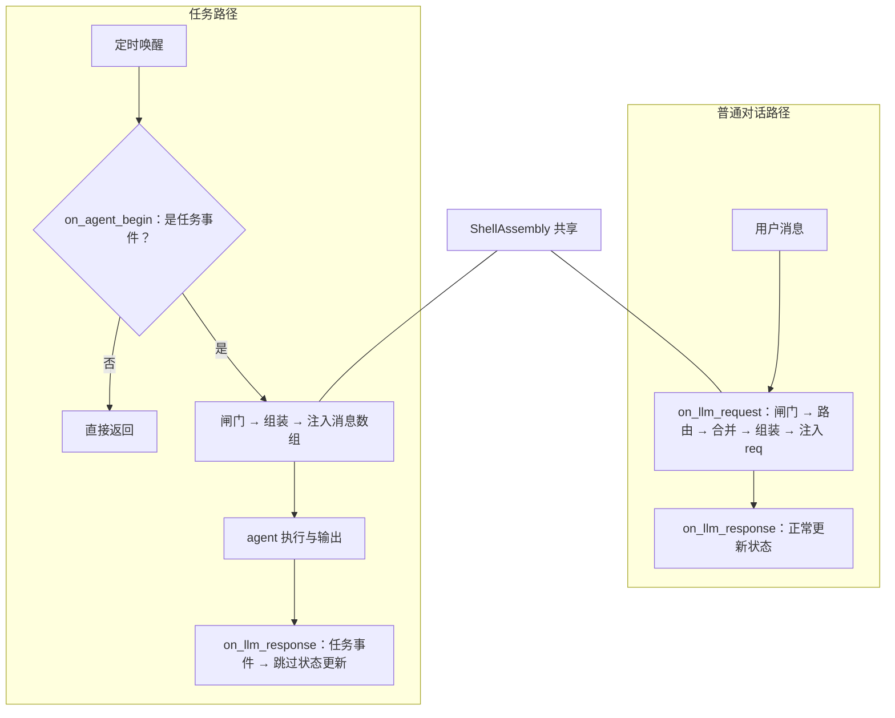

# 任务流程人格外壳集成 · 开发计划（P0 & P1）

> 关联设计：`DESIGN_task_shell.md`
> 本次范围：**仅 P0（G2 状态守卫）与 P1（G1 任务路径注入外壳）**
> 不在本次范围：P2（自有提醒工具 / 决策 4）—— 仅作为后续观察项（见 §8）
> 状态：待评审 → 待实现

---

## 0. 决策锁定与范围

### 0.1 已锁定决策

| 编号 | 决策 | 对本计划的影响 |
|---|---|---|
| D1 | 任务触发**不受**「免打扰时段 / 情绪」约束 | 插件**不干预**任务触发，不在输入侧加任何闸门；只做外壳注入 |
| D2 | 任务收尾**不写入** `recent_topics` | P0 的守卫为「任务路径**完全跳过**状态更新」 |
| D3 | 输出侧接受「仅引导」 | 本次**不实现**任何输出改写/拦截；输出质量由 P1 注入 + note 语域承担 |

### 0.2 本次交付的两个缺口

| 编号 | 缺口 | 本次是否修复 |
|---|---|---|
| **G2** | 任务「收尾」污染情绪状态（误判 reunion、错误改写心情、误写计数） | ✅ P0 |
| **G1** | 任务「触发 + 执行」不注入认知外壳 | ✅ P1 |
| 输出语域 | 任务输出语气不稳定 | 由 P1 间接改善；不做专门实现 |
| 统一收口 | 主动消息与任务共用接口 | ❌ 后续 |

### 0.3 硬约束（沿用设计文档 §2）

1. 只改 `data/plugins/astrbot_plugin_Firefly/`，**主程序一行不改**
2. 只用 AstrBot 公开的插件钩子与配置项
3. 能力探测 + 静默降级：上游接口/时机变化时跳过，**绝不抛异常、绝不中断主流程**
4. 单一数据源：状态只在 Firefly 的 `cognitive_state.json`
5. core / adapter 分层：`core/` 不 import astrbot
6. 现有 89 个测试**必须保持全绿**（普通对话路径行为不得回归）

---

## 1. 阶段性开发路线图

### 阶段总览

| 阶段 | 目标 | 依赖 | 可独立合并 |
|---|---|---|---|
| **P0** | 任务事件不再污染情绪状态 | 无 | ✅ |
| **P1** | 任务执行时注入完整外壳 | P0（共用事件判定） | ✅ |

> P0 先行的理由：它是纯缺陷修复、风险最低，且 P1 会复用 P0 引入的「任务事件判定」，先落地可避免重复实现。

---

### 1.1 P0：任务事件状态守卫

#### P0-1 引入「任务事件判定」

- **目标**：提供一个可靠、可复用、可观测的判定：当前 LLM 响应事件是否来自任务路径。
- **判定信号（双保险）**：
  1. 主信号：`event.platform_meta.name == "cron"`
     依据：`astrbot/core/cron/events.py` 的 `CronMessageEvent` 使用 `PlatformMetadata(name="cron", ...)`
  2. 兜底信号：`event.get_extra("cron_job")` 为真
     依据：`cron/manager.py` 的 `_run_active_agent_job` 会写入 `extras["cron_job"]`
- **放置位置**：`adapter/injector.py` 内作为私有静态方法（判定依赖 astrbot 事件对象，不能进 `core/`）
- **健壮性要求**：全部用 `getattr` / 默认值访问，任何属性缺失一律判定为「非任务事件」（保守回退到旧行为，不误伤普通对话）
- **涉及文件**：`adapter/injector.py`
- **依赖**：无
- **验收**：三种情形（仅主信号命中 / 仅兜底信号命中 / 两者都不命中）判定正确

#### P0-2 `_update_state` 增加任务路径早退

- **目标**：任务事件到达响应钩子时，**完全跳过**状态更新。
- **行为**：命中任务事件 → 立即返回，且：
  - 不回灌任何 `AffectEvent`
  - 不触发 `reunion`、不清零 `unanswered_count`
  - 不更新 `last_user_at` / `last_message_at`
  - 不调用 `update_recent_topics`（D2）
  - 不清空/消费 `_pending_signals`（该会话本就不应有）
- **可观测**：记录一条「任务事件跳过状态更新」的调试记录（原因可查）
- **涉及文件**：`adapter/injector.py`
- **依赖**：P0-1
- **验收**：见 §4 测试矩阵 T0-1 ~ T0-4

#### P0-3 回归确认

- **目标**：确认普通对话路径行为**完全不变**。
- **验收**：现有 89 个测试全绿，其中 `tests/test_injector.py` 的 reunion / 心情更新用例不受影响。

---

### 1.2 P1：任务执行时注入外壳

#### P1-0（前置验证，必须先做）确认注入可行性与位置

这是一个**必须实测的未知项**，决定后续实现细节，不能靠推断。

需要确认三件事：

| 待验证 | 为什么要问 | 影响 |
|---|---|---|
| `run_context.messages` 在 `on_agent_begin` 触发时**是否已构建** | 若尚未构建，则注入会被后续构建覆盖 | 决定注入时机是否可行 |
| 消息数组的**实际结构**（role 序列、最后一条 user 消息的 content 是 str 还是 list） | 决定注入方式（追加内容块 vs 新增消息） | 决定注入实现 |
| 注入内容能否**存活过上下文压缩**（`request_context_manager.process`，在钩子之后执行） | 若被压缩裁掉，注入等于无效 | 决定是否需要调整注入位置或尺寸 |

- **产出**：一份实测结论（写回本计划或设计文档），明确：注入位置方案、是否可行、是否需要调整
- **失败处置**：若确认「`on_agent_begin` 注入不可行或被压缩吃掉」，则**停止 P1** 并把结论写回设计文档（回到决策层，而不是硬做）

##### P1-0 实测结论（已完成，可执行验证）

**结论：可行，但原计划的注入位置必须修正。**

| 未知项 | 结论 | 依据 |
|---|---|---|
| **S-1** `messages` 是否已构建 | ✅ **已构建** | `tool_loop_agent_runner.py:323` 在 `reset()` 中赋值；`on_agent_begin` 在 `:807` 的 `step()` 中触发，时序在后 |
| **S-2** 消息结构 | ✅ **`[system, ...历史..., user(str)]`** | 实测 `ProviderRequest.assemble_context()`：cron 路径（有 prompt、无额外内容块）返回 `{"role":"user","content": str}`；普通对话（有 `extra_user_content_parts`）返回 content 列表 |
| **S-3** 能否存活过压缩 | ⚠️ **取决于注入位置** | 见下表 |

**S-3 关键发现（原计划的注入位置会被压缩丢弃）**：

实测 `ContextTruncator.truncate_by_dropping_oldest_turns` 与 `_extract_system_messages`：

| 注入位置 | 截断 drop_turns=1 | 截断 drop_turns=2 | LLM 摘要路径 |
|---|---|---|---|
| **user 消息**（原计划） | ❌ **丢失** | ❌ **丢失** | ❌ 取不到 |
| **system 消息**（修正后） | ✅ 存活 | ✅ 存活 | ✅ 存活 |

原因：`truncator.py:146-173` 丢弃最旧的 N 轮后，由 `_ensure_user_message` 只恢复「**原列表中的第一条 user 消息**」（即历史消息），因此**注入到最后一条 user 的消息会被丢弃**；而 system 消息由 `_split_system_rest` 单独保留，任何策略都不会丢。

补充事实：**当前真实配置下截断实际不会触发**（`max_context_tokens=0`、`compression.max_turns=-1`），但一旦用户调整上下文上限，或触发 LLM 摘要溢出路径，user 位置的注入就不可靠。

**共同决定（P1-2 据此修正）**：

> **外壳注入到 `messages` 中最前面的 system 消息**（追加到其 content 末尾），而不是注入到 user 消息。
> 理由：① 在所有压缩策略下都存活；② system 位置权威更高，更利于人设遵守；③ cron 唤醒是一次性会话，无需考虑 prompt 缓存。

**残余风险**：若 `messages` 中没有 system 消息（cron 路径不会发生，因为 `req.system_prompt` 必然有值），回退为「插入一条 system 消息」或「追加到最后一条 user 消息」，并记录降级原因。

#### P1-1 注册 `on_agent_begin` 钩子（main.py）

- **目标**：把 AstrBot 的 `on_agent_begin` 钩子接到注入器。
- **处理函数签名**（已核实 `call_event_hook` 会以 `(event, *args)` 调用 handler）：
  `async def handler(self, event: AstrMessageEvent, run_context) -> None`
- **涉及文件**：`main.py`（新增薄转发，风格与现有 `handle_llm_request` 一致）
- **依赖**：P1-0
- **验收**：钩子被正确注册且不报错

#### P1-2 实现任务路径注入（injector）

- **目标**：任务事件到达 agent 开始时，把外壳注入最终消息数组。
- **处理流程**（顺序即守卫顺序）：
  1. **路径判定**：非任务事件 → 直接返回（普通对话不走此分支，从根本上避免双注入）
  2. **同构闸门**：`enabled` → 会话白名单 → `registry.is_loaded`
  3. **次要去重**：消息数组中已存在 `SHELL_INJECTION_MARK` → 跳过（保险丝）
  4. **组装**：复用共享外壳构建（见 P1-3），为空则跳过
  5. **注入**：追加到 `messages` 中**最前面的 system 消息**的内容末尾（依据 P1-0 实测结论：仅 system 位置能在所有压缩策略下存活，且权威更高）。若不存在 system 消息，回退为插入一条 system 消息，并记录降级原因
  6. **记录**：写入调试记录（路径=`agent_begin`、是否注入、跳过原因）
- **关键设计决策**：**用「显式路径判定」而非「模糊去重」**
  - 普通对话只走 `on_llm_request`，任务只走 `on_agent_begin`，两条路径互斥
  - 这样不需要依赖「消息里是否已有标记」来区分路径，避免去重与闸门之间的语义歧义
- **涉及文件**：`adapter/injector.py`
- **依赖**：P0-1（复用任务事件判定）、P1-1
- **验收**：见 §4 测试矩阵 T1-1 ~ T1-5

#### P1-3 抽取共享逻辑（保证架构整洁）

- **目标**：避免两套守卫与两套组装逻辑，保持单一职责与可测试性。
- **抽取内容**（均为私有方法，仅 `adapter/injector.py` 内复用）：
  - `_check_gates(session_id, config) -> str | None`：统一的「能力/开关」闸门（enabled / 会话白名单 / 资料已加载），返回跳过原因或 None
  - `_build_shell_text(state, config) -> str | None`：统一的外壳组装（复用 `ShellAssembly.build` + 空结果判定）
- **改造范围**：`_inject`（普通对话）改用上述两个共享方法；**行为必须零变化**
- **依赖**：P1-0
- **验收**：重构后普通对话注入的 XML 内容**逐字节一致**；89 个测试全绿

#### P1-4 可观测性补齐

- **目标**：注入路径与跳过原因可查，避免「静默失效」。
- **内容**：
  - 调试记录中区分来源：`llm_request` / `agent_begin`
  - 任务路径的每个跳过原因（`not_task_event` / `disabled` / `session_filtered` / `empty_registry` / `duplicate` / `empty_build` / `error`）均可查
  - 异常路径记录异常摘要（不记录敏感内容）
- **涉及文件**：`adapter/injector.py`、`adapter/debug_recorder.py`、`adapter/debug_api.py`（如需展示来源字段）
- **依赖**：P1-2
- **验收**：可从调试面板/接口确认「本轮任务是否注入了外壳、走哪条路径」

#### P1-5 单元与集成测试

- **目标**：覆盖 P0/P1 的核心逻辑与边界。
- **涉及文件**：`tests/test_injector.py`（扩展）、必要时新增 `tests/test_task_event.py`
- **验收**：见 §4

---

## 2. 系统架构设计

### 2.1 分层与职责（不新增模块，只增强既有组件）

| 层 | 组件 | 职责 | 本次变化 |
|---|---|---|---|
| `core/` | `assembly.py` / `affect.py` / `models.py` | 纯逻辑：外壳组装、情绪、状态模型 | **不改** |
| `adapter/` | `injector.py` | 外壳注入的唯一归属地（两条路径） | **新增任务路径分支 + 抽取共享方法** |
| `adapter/` | `debug_recorder.py` | 观测记录 | 扩展来源字段 |
| 根 | `main.py` | 钩子注册与薄转发 | 新增 `on_agent_begin` 转发 |

**为什么不新增模块**：本次仍是「注入外壳」这一件事，只是多了一条触发路径。放进 `CognitiveShellInjector` 保持**内聚**（所有注入保证集中一处），避免为单一职责再造一层。`core/` 完全不动，符合分层约定。

### 2.2 关键设计决策

| 决策 | 选择 | 理由 |
|---|---|---|
| 路径识别方式 | **显式判定**（平台名 + extras 双保险） | 避免「靠标记去重」在闸门与去重之间的语义歧义 |
| 两条路径的关系 | **互斥**（普通→`on_llm_request`；任务→`on_agent_begin`） | 从结构上消除双注入，而非靠去重兜住 |
| 任务路径的输入侧动作 | 只做「读状态 → 组装 → 注入」 | 任务唤醒无用户意图，不需要路由/合并；持久化不在此处做 |
| 任务路径的收尾动作 | **完全跳过** | 锁定决策 D2；且任务不是「用户说话」 |
| 组装逻辑 | 复用 `ShellAssembly.build` + 预算 | 单一数据源与统一裁剪行为 |
| 注入失败处置 | 整体 try/except + 记录 + 跳过 | 守则要求：绝不中断主流程 |

### 2.3 数据流

### 2.4 修改清单

| 文件 | 变化 | 说明 |
|---|---|---|
| `adapter/injector.py` | 新增/重构 | 任务事件判定、`on_agent_begin`、共享闸门与组装、`_update_state` 守卫 |
| `main.py` | 新增 | `on_agent_begin` 薄转发 |
| `adapter/debug_recorder.py` | 扩展 | 来源字段（llm_request / agent_begin） |
| `tests/test_injector.py` | 扩展 | 新增任务路径用例 |
| `DESIGN_task_shell.md` | 回写 | P1-0 实测结论 |

**不修改**：`core/` 全部、`_conf_schema.json`（**不需要新配置项**——本次无开关变更，D1 明确不干预触发）。

---

## 3. 边界条件与异常处理方案

### 3.1 判定类边界

| 边界 | 处理 |
|---|---|
| 事件对象缺 `platform_meta` | `getattr` 兜底，判定为非任务事件 |
| `platform_meta.name` 为空/非字符串 | 判定为非任务事件 |
| `get_extra` 不存在或抛错 | 捕获后跳过该信号，继续用其它信号 |
| 上游改了平台名或 extras 键名 | 判定失效 → **回退到旧行为**（会重新出现 G2），因此**必须靠可观测发现**；在设计文档记录该风险 |
| 「像任务但不是任务」的事件（例如未来其它插件直连 agent） | 当前判定为「非任务」→ 走普通逻辑；记录为后续观察项 |

### 3.2 注入类边界

| 边界 | 处理 |
|---|---|
| 会话被禁用 / 不在白名单 | 与普通对话同构闸门，跳过并记录原因 |
| 资料未加载 | 跳过并记录 `empty_registry` |
| 外壳为空 | 跳过并记录 `empty_build` |
| 消息数组为空 | 跳过（不构造异常结构） |
| 最后一条 user 消息 content 为 str | 按 P1-0 结论选择「新增消息」回退分支 |
| 消息数组结构不符合预期 | 整体捕获 + 记录 + 跳过，不影响 agent 执行 |
| 注入内容被上下文压缩裁掉 | P1-0 验证；若无法存活，调整位置或限制尺寸 |
| 外壳超预算 | 复用 `ShellBuilder` 预算与裁剪，不额外加逻辑 |
| 同一 agent 运行内重复触发 `on_agent_begin` | 钩子在 `AgentState.IDLE` 只触发一次（已核实）；另加标记去重作保险 |

### 3.3 并发与生命周期

| 边界 | 处理 |
|---|---|
| 同会话并发多次 agent 运行 | 注入为每轮独立操作，无跨轮共享可变状态；状态读取走 `StateStore`（自带锁，短操作持锁） |
| **不跨 LLM 调用持锁** | 组装与注入不涉及锁；不新增长时间持锁 |
| 插件被卸载/重载 | 钩子随插件生命周期注销；无额外清理需求（不新增后台任务） |
| 钩子内异常 | 即便被 AstrBot 的 `call_event_hook` 捕获，我们仍自行 try/except 保证可观测 |

### 3.4 不得触碰的红线

1. **不调用 `event.stop_event()`**：`call_event_hook` 会因事件被停止而提前返回，可能影响其它插件与主流程
2. **不修改 `req` / 不使用 `on_llm_request` 的注入逻辑处理任务路径**（保持两路径互斥）
3. **不改 `unanswered_count` / `last_user_at` / 心情**（D2）
4. **不新增配置项**（本次无开关变更）

---

## 4. 测试与验证计划

### 4.1 P0 测试矩阵

| 编号 | 用例 | 期望 |
|---|---|---|
| T0-1 | 任务事件（主信号）到达响应钩子 | 状态零变化：mood / mood_intensity / topics / unanswered_count / last_user_at 全部不变 |
| T0-2 | 任务事件（仅兜底信号命中） | 同 T0-1 |
| T0-3 | 任务事件且 `unanswered_count > 0` | **不**触发 reunion、**不**清零计数（这是 G2 的核心断言） |
| T0-4 | 普通用户事件 | 行为与改动前完全一致（心情更新、话题更新、reunion 正常） |
| T0-5 | 事件对象缺关键属性 | 判定为非任务事件，不抛异常 |

### 4.2 P1 测试矩阵

| 编号 | 用例 | 期望 |
|---|---|---|
| T1-1 | 任务事件 + 正常配置 | 消息数组中出现 `<cognitive_shell>`，含 `<static_core>` 与 `<dynamic_state>` |
| T1-2 | 任务事件 + 插件禁用 | 不注入，记录 `disabled` |
| T1-3 | 任务事件 + 会话不在白名单 | 不注入，记录 `session_filtered` |
| T1-4 | 任务事件 + 资料未加载 | 不注入，记录 `empty_registry` |
| T1-5 | 普通对话事件到达 `on_agent_begin` | **直接返回**，消息数组不被改动（保证不双注入） |
| T1-6 | 外壳为空 | 不注入，记录 `empty_build` |
| T1-7 | 消息数组结构异常 | 捕获异常、跳过、不抛出 |
| T1-8 | 注入内容断言 | 注入位置与结构符合 P1-0 结论；token 不超过预算 |
| T1-9 | 注入后消息数组长度/role 序列 | 符合预期，未破坏原有顺序 |

### 4.3 回归测试

- 现有 **89 个测试全绿**（重点：`tests/test_injector.py` 的注入与状态更新用例）
- P1-3 重构后，普通对话注入的 XML 与重构前**逐字节一致**

### 4.4 必须实测的未知项（阻塞式）

| 编号 | 未知项 | 阻塞 | 失败处置 |
|---|---|---|---|
| S-1 | `run_context.messages` 在 `on_agent_begin` 时是否已构建 | P1-2 | 若未构建：改在 `on_agent_end` 之前其它钩子，或回到决策层 |
| S-2 | 消息数组实际结构（role 序列 / content 类型） | P1-2 注入方式 | 按实际情况选注入方案 |
| S-3 | 注入内容能否存活过上下文压缩 | P1-2 | 调整位置/尺寸；仍不行则停止 P1 |

**原则**：S-1 ~ S-3 未取得结论前，不进入 P1-2 的正式实现。

### 4.5 验证手段

- 单元/集成测试：`python -m unittest discover -s tests -t data/plugins`
- 代码检查：`ruff format .` + `ruff check .`
- 手工端到端：建一个短时任务（如 1 分钟后触发），观察：
  1. 任务执行时注入是否生效（调试面板/日志）
  2. 触发后 Firefly 状态**未被**改写（对照触发前后的 `cognitive_state.json`）
  3. 输出语气是否改善（D3 的观察点，不作硬性断言）

---

## 5. 交付验收标准

| 编号 | 标准 | 判定方式 |
|---|---|---|
| A1 | 任务事件不再污染情绪状态 | T0-1 ~ T0-3 全过；手工端到端状态对照 |
| A2 | 任务执行时注入完整外壳 | T1-1 通过；手工端到端可见 |
| A3 | 普通对话路径零回归 | 89 测试全绿 + XML 逐字节一致 |
| A4 | 异常不中断主流程 | T1-7 通过；钩子内异常被记录而非上抛 |
| A5 | 可观测 | 能从记录中区分注入来源与跳过原因 |
| A6 | 无主程序改动 | `git status` 中不含 `astrbot/` 下任何文件 |
| A7 | 代码检查 | `ruff format` + `ruff check` 无告警 |

---

## 6. 风险与回退

| 风险 | 影响 | 缓解 / 回退 |
|---|---|---|
| S-1/S-2/S-3 任一不成立 | P1 无法交付 | P1-0 前置验证拦住；结论回写设计文档，回到决策层 |
| 上游改平台名 / extras 键名 | 任务事件识别失效 → G2 复发 | 双保险信号 + 可观测；识别为「非任务」时保守回退旧行为（不误伤普通对话） |
| 注入被压缩裁掉 | 外壳形同虚设 | S-3 验证；调整位置/尺寸 |
| P1-3 重构引入回归 | 普通对话注入出问题 | 独立提交 + 逐字节对比 + 全量回归 |
| 任务路径不路由导致外壳内容偏少 | 任务时缺激活资料 | 已知取舍（任务无用户意图）；若需要，后续再评估 |

**回退策略**：P0、P1 分别独立提交，任一阶段出问题可单独回退，不影响另一阶段。

---

## 7. 提交规划（建议）

| 提交 | 内容 | 说明 |
|---|---|---|
| 1 | `fix(firefly): ignore task events when updating session state` | 仅 P0，风险最低，可立即合入 |
| 2 | `refactor(firefly): extract shared shell assembly and gates` | P1-3，行为不变 |
| 3 | `feat(firefly): inject cognitive shell for task agent runs` | P1-2/P1-4/P1-5 |

---

## 8. 后续观察项（不在本次范围）

| 项 | 说明 | 触发条件 |
|---|---|---|
| P2 自有提醒工具（决策 4） | 用自有 `@llm_tool` + note 规范强化创建时语域 | 当 P1 落地后「创建时」语域实测仍不足时再评估 |
| 输出侧过滤 | **不是改写语气**，只针对可枚举的违规（元信息/机制词泄漏） | 实测出现具体违规模式时 |
| 任务路径连续性 | 用**独立字段**承载「她答应过的事」，不污染 `recent_topics` | 出现真实连续性缺失痛点时 |
| 识别扩展 | 覆盖未来其它直连 agent 的运行路径 | 出现此类路径时 |
| 统一收口（R9） | 主动消息与任务共用外壳/投递接口 | 出现真实重复代码时 |

---

## 9. 一句话总结

> **P0 修 G2：用「任务事件判定」让任务收尾完全跳过状态更新（双保险信号 + 保守回退旧行为）。**
> **P1 修 G1：用 `on_agent_begin` 在任务执行前注入外壳（显式路径判定，与普通对话路径互斥，从结构上消除双注入）。**
> 两条路径各自独立提交、独立回退；`core/` 与配置零改动；所有未知项（S-1/S-2/S-3）在正式实现前先实测，不靠推断。
