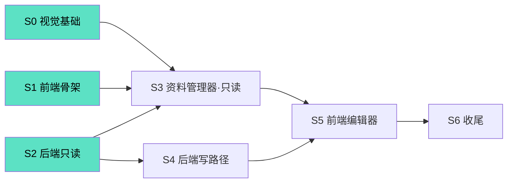
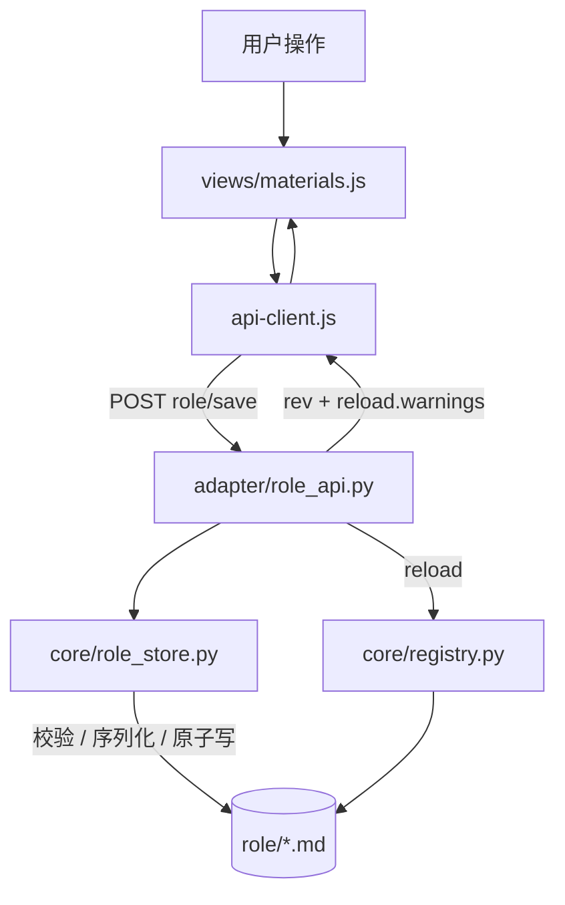

# 调试面板改造 + role 资料可视化编辑 · 开发计划

> 关联设计：`DESIGN_ui_role_editor.md`
> 本次范围：设计文档 §10 的 P0–P2（视觉改造 + 只读树 + 写路径），P3 仅列为后续观察项
> 状态：待评审 → 待实现
> 硬约束：只改 `data/plugins/astrbot_plugin_Firefly/`，主程序一行不改

---

## 0. 决策锁定与范围

### 0.1 已锁定决策（设计 §2）

| 编号 | 决策 | 对本计划的影响 |
|---|---|---|
| D1 | 合并进「资料浏览」Tab，整体重做 | 不做「资料浏览」的原地增量改造；阶段 3 整体替换该视图 |
| D2 | **硬删除** | 不做回收站；必须实现三重守卫（§3.4） |
| D3 | 允许全文编辑 + 结构化控件 | 编辑器同时提供 `raw` 与表单两条路径，服务端权威解析 |
| D4 | 萤火青绿主色 | 阶段 0 的 token 直接落地，不保留蓝紫主色 |
| D5 | 仅编辑 `role/` | 写接口根目录固定，不做多目录配置 |

### 0.2 本次交付的三块能力

| 能力 | 是否交付 |
|---|---|
| 明/暗双主题 + 视觉改造 | ✅ 阶段 0 + 阶段 1 |
| `role/` 只读目录树（含被 registry 丢弃的文件） | ✅ 阶段 2 + 阶段 3 |
| `role/` 文件级增删改（结构化 + 全文） | ✅ 阶段 4 + 阶段 5 |
| Markdown 预览 / 重命名 / 移动 | ❌ 阶段 6（后续观察项） |

### 0.3 硬约束

1. 只改 `data/plugins/astrbot_plugin_Firefly/`，主程序一行不改。
2. `core/role_store.py` 不 import astrbot / quart；`adapter/role_api.py` 只做 HTTP 薄层。
3. **不修改 `adapter/debug_api.py`**（保持只读语义）。
4. 写接口开放前，frontmatter round-trip 必须已有测试保护。
5. 现有 `tests/` 全部保持绿色。
6. 前端不引入构建链，保持静态直出 + 原生 ES Module。

---

## 1. 阶段性开发路线图

### 1.1 阶段总览

| 阶段 | 目标 | 依赖 | 可独立合并 | 规模 |
|---|---|---|---|---|
| **S0** | 视觉基础：设计 token + 明暗双主题 | 无 | ✅ | S |
| **S1** | 前端骨架：`dom.js` + `views/` + `app.js` 壳（无行为变化） | 无 | ✅ | M |
| **S2** | 后端只读：解析器增强 + `role_store` + `role_api` GET | 无 | ✅ | M |
| **S3** | 前端资料管理器（只读两栏） | S1、S2 | ✅ | L |
| **S4** | 后端写路径：`save` / `delete` + 全部边界控制 | S2 | ✅ | L |
| **S5** | 前端编辑器（结构化 + 全文 + 删除确认） | S3、S4 | ✅ | L |
| **S6** | 收尾（Markdown 预览 / 重命名 / 活跃提示强化） | S5 | ✅ | S |

**排序理由**

- S0 与 S1 是纯前端、风险低，先落地可立即改善观感，并为 S3/S5 提供组件基础。
- S2 只动 `core/` + `adapter/`，与 S0/S1 **文件不相交，可并行开发**。
- S4 依赖 S2 的 `role_store`，但不依赖 S3；后端可先于前端编辑器合并。
- **不做全量前端重写的「大爆炸」**：S1 只迁移 5 个存量 Tab，`materials` 视图原样搬入占位，等 S3 整体替换，避免二次返工。

### 1.2 依赖关系

- 绿底（S0/S1/S2）**三路可并行**，互不阻塞。
- 关键路径：`S2 → S4 → S5`（写能力）。

---

## 2. 详细任务分解

### 2.1 阶段 S0：视觉基础（设计 token + 双主题）

#### S0-1 引入设计 token

- **目标**：把散落的颜色/间距/圆角收敛为 CSS 变量，并支持 AstrBot 主题。
- **内容**：
  - `:root` 保留暗色为默认；新增 `:root[data-theme="light"]` 覆盖（响应 `plugin_page_bridge.js:125-144` 注入的 `data-theme`）。
  - 主色改萤火青绿：`--accent: #5ce1c4`（暗）/ `#0f9e86`（亮）；保留紫色作 `--kind` 徽标色。
  - 新增 `--sp-1..5`、`--radius-sm/md/lg`、`--shadow-1/2`、`--transition`、字号阶梯。
- **涉及文件**：`pages/dashboard/styles.css`
- **依赖**：无
- **验收**：
  - 明/暗切换跟随 Dashboard，无残留硬编码色值（`grep` 确认无 `#7c8aff` 等散落值）。
  - 现有 6 个 Tab 在两种主题下均可读、对比度足够。

#### S0-2 统一组件类

- **目标**：为 S1/S3/S5 提供可复用的组件样式。
- **内容**：`.panel` / `.field` / `.badge` / `.btn`（primary/ghost/danger/sm）/ `.tree` / `.editor` / `.dialog` / `.empty` / `.skeleton`。
- **涉及文件**：`pages/dashboard/styles.css`
- **依赖**：S0-1
- **验收**：存量页面改用统一类后视觉不回退。

---

### 2.2 阶段 S1：前端骨架重构（无行为变化）

> 目标：把 478 行 IIFE 拆为「壳 + 共享工具 + 视图模块」，**不改变任何功能**。

#### S1-1 抽取 `modules/dom.js`

- **目标**：统一 DOM 工具，消除重复的 `esc`/`toast`/`confirm`。
- **内容**：`byId`、`esc`、`on`（事件委托）、`el`（节点构建）、`toast`（可堆叠）、`confirmDialog`（Promise 化，替换原生 `confirm`）、`formatBytes`、`formatTime`。
- **涉及文件**：新增 `pages/dashboard/modules/dom.js`
- **依赖**：无
- **验收**：提供单元可读的纯函数；`confirm` 全部替换为 `confirmDialog`。

#### S1-2 改造 `app.js` 为 Tab 壳

- **目标**：`app.js` 只做 Tab 注册、视图调度、启动、全局状态装载。
- **内容**：视图注册表 `{ id, label, mount(container), refresh() }`；Tab 切换只切换可见性与触发加载。
- **涉及文件**：`pages/dashboard/app.js`、`pages/dashboard/index.html`
- **依赖**：S1-1
- **验收**：Tab 数量与文案不变；刷新按钮、状态徽标行为不变。

#### S1-3 迁移 5 个存量视图

- **目标**：把注入日志 / 状态面板 / 路由测试 / 注入预览 / 系统统计 5 个视图拆入独立模块。
- **内容**：`views/injections.js`、`state.js`、`route.js`、`preview.js`、`stats.js`；**各视图行为逐项对齐原实现**。
- **涉及文件**：新增 `pages/dashboard/views/*.js`
- **依赖**：S1-2
- **验收**：手工清单逐项通过（见 §4.1）。

#### S1-4 `materials` 占位迁移 + 消除 XSS 拼串

- **目标**：`materials` 原样搬入 `views/materials.js` 作为占位（S3 整体替换）；同时清除既有字符串拼 HTML 隐患。
- **内容**：
  - 删除所有 `onclick="FF.x"`，改 `data-*` + 事件委托。
  - 未转义注入点修正：`app.js:223-226`（`entry_id`）、`:300`（`session_id`）、`:332`（`m.id`）。
- **涉及文件**：`pages/dashboard/views/materials.js`、`pages/dashboard/views/*.js`
- **依赖**：S1-2
- **验收**：`grep` 无 `onclick="FF.`；构造含 `'` / `<` 的 id 不破坏 DOM。

#### S1-5 回归确认

- **目标**：确认 6 个 Tab 功能与重构前一致。
- **验收**：§4.1 手工清单全过；`api-client.js` 未改动。

---

### 2.3 阶段 S2：后端只读（解析器增强 + `role_store` + `role_api` GET）

#### S2-1（前置，必须先做）frontmatter 解析器 round-trip 增强

> **这是阻塞 S4 的未知项**（设计 §7.4）。没有 round-trip 保证，写接口不得开放。

- **目标**：让 `parse_frontmatter` 能无损读回「序列化器写出的文本」。
- **内容**：
  - `core/parsers.py` 的 `_parse_value`：标量成对 `"…"` / `'…'` 剥离引号并反转义（当前会把引号留在字符串里）。
  - 明确解析边界：列表内元素支持引号；`#` 仅在行首视为注释。
- **涉及文件**：`core/parsers.py`
- **依赖**：无
- **验收**：见 §4.2 T2-1；现有 `test_loader.py` 全绿。

#### S2-2 `core/role_store.py`：路径校验与树构建

- **目标**：纯逻辑实现「安全路径解析」与「目录树列举」。
- **内容**：
  - `validate_rel_path(rel, *, is_dir)`：拒绝绝对路径 / `..` / `:` 段 / UNC / 保留名；段级白名单 + NFC 规范化；深度 ≤ 8；仅 `.md`。
  - `list_tree(include_hidden)`：**以文件系统为准**构建，合并 registry 元数据，产出 `status`（`registered` / `empty_body` / `duplicate_id` / `read_error` / `hidden`）。
  - `read_document(path)`：返回 `raw` / `frontmatter` / `unknown_keys` / `body` / `rev`（`sha256[:16]`）/ `mtime` / `size`。
- **涉及文件**：新增 `core/role_store.py`
- **依赖**：S2-1
- **验收**：见 §4.2 T2-2 ~ T2-6。

#### S2-3 `adapter/role_api.py`：只读路由

- **目标**：注册 `GET role/tree`、`GET role/file`。
- **内容**：复用 `debug_api.py` 的 `ok()/error()`；插件名从 `context.star_metadata` 动态获取（与 `debug_api.py:85-92` 一致）。
- **涉及文件**：新增 `adapter/role_api.py`；`main.py` 注册（与 `_register_debug_api` 并列，仍是能力探测 + 静默降级）
- **依赖**：S2-2
- **验收**：接口返回结构与设计 §6.1/§6.2 一致；路径非法返回 `{status:"error"}` 而非 500。

#### S2-4 只读接口单元测试

- **涉及文件**：新增 `tests/test_role_store.py`
- **依赖**：S2-2
- **验收**：见 §4.2。

---

### 2.4 阶段 S3：前端资料管理器（只读两栏）

#### S3-1 目录树左栏

- **目标**：渲染 `role/tree`，按顶层目录分组的可折叠树。
- **内容**：搜索（路径 / id / title / tags）、`tier`/`kind` 过滤、「显示隐藏文件」开关、状态徽标（`T1~T4`、`kind`、`空正文` / `ID冲突` / `读失败`）、registry `warnings` 横幅。
- **涉及文件**：`pages/dashboard/views/materials.js`
- **依赖**：S2-3、S1-2
- **验收**：86 个 `.md` 全部可见；`empty_body` / `duplicate_id` 条目有明确标记且可点击查看。

#### S3-2 只读详情右栏

- **目标**：点击节点展示元数据与正文（此阶段只读）。
- **内容**：面包屑、状态徽标（`rev` / `mtime` / 注册状态）、结构化字段展示、正文只读展示、「原始全文」切换（只读）。
- **涉及文件**：`pages/dashboard/views/materials.js`
- **依赖**：S3-1
- **验收**：与 `materials/detail` 旧接口结果对账一致。

#### S3-3 删除旧 `materials` 读取路径

- **目标**：前端不再依赖 `materials`、`materials/detail`（后端接口保留不动）。
- **涉及文件**：`pages/dashboard/views/materials.js`
- **验收**：`grep` 前端无 `materials/detail` 调用。

---

### 2.5 阶段 S4：后端写路径

#### S4-1 规范化序列化器

- **目标**：把 `frontmatter + body` 写回为**可被 S2-1 解析器无损读回**的文本。
- **内容**：已知键固定顺序（`type`→`kind`→`title`→`id`→`tags`→`keywords`→`patterns`→`tier`→`priority`→`default_ttl`）；含 `:` `#` `[` `]` 或首尾空格的值加双引号并转义；未知键从原文件按原行保留。
- **涉及文件**：`core/role_store.py`
- **依赖**：S2-1
- **验收**：round-trip 测试通过（§4.3 T3-1）。

#### S4-2 `save`：新建 / 覆盖

- **目标**：实现服务端权威写路径。
- **内容（守卫顺序）**：
  1. 路径校验（S2-2）
  2. 隐藏前缀拒绝；扩展名仅 `.md`
  3. 大小 ≤ 256 KiB；正文非空
  4. `create=true` 时目标不得存在；`create=false` 时 `base_rev` 必须匹配（乐观锁）
  5. ID 唯一性（排除自身路径）；留空按文件名 stem 生成并同样校验
  6. `tier`/`kind` 未填时按 `_infer_tier_kind`（`registry.py:20-46`）推断
  7. 原子写：同目录临时文件 → `os.replace`；`asyncio.to_thread` 包装 IO
  8. `registry.reload()`，把 `warnings` 一并返回
- **涉及文件**：`core/role_store.py`、`adapter/role_api.py`
- **依赖**：S2-3、S4-1
- **验收**：见 §4.3。

#### S4-3 `delete`：硬删除 + 三重守卫

- **目标**：硬删除，但不可误触。
- **内容**：
  1. `base_rev` 匹配
  2. `confirm_name` 与文件名逐字符相同
  3. 若该 `id` 被会话激活，响应中返回活跃会话数（供前端二次确认）
  - 删除后 `registry.reload()`。
- **涉及文件**：`core/role_store.py`、`adapter/role_api.py`
- **依赖**：S4-2
- **验收**：三重守卫任一不满足即拒绝；删除后 registry 立即不再收录。

#### S4-4 写路径单元测试

- **涉及文件**：`tests/test_role_store.py`（扩展）
- **依赖**：S4-1 ~ S4-3
- **验收**：见 §4.3。

---

### 2.6 阶段 S5：前端编辑器

#### S5-1 结构化表单

- **目标**：可编辑资料元数据。
- **内容**：
  - 下拉框：`type`（附"当前运行时由 tier 与 keywords 决定行为"提示）、`kind`、`tier`（附"由目录推断，可覆盖"）。
  - 输入框：`id`、`title`、`priority`、`default_ttl`。
  - 标签输入：`keywords`、`tags`、`patterns`（回车/逗号成标签，可删）。
- **涉及文件**：`pages/dashboard/views/materials.js`
- **依赖**：S3-2
- **验收**：字段与设计 §8.3 一致；空值不下发或按服务端默认处理。

#### S5-2 正文 + 全文模式

- **目标**：正文 textarea + 「原始全文」折叠模式，两模式切换时双向同步。
- **内容**：切换前提示可能覆盖未保存的表单改动；保存时按当前模式提交 `raw` 或结构化字段。
- **涉及文件**：`pages/dashboard/views/materials.js`
- **依赖**：S5-1、S4-2
- **验收**：两种模式保存后重新加载内容一致；未知键在全文模式下可见且保存后保留。

#### S5-3 保存 / 撤销 / 脏状态 / 冲突

- **目标**：完整的编辑生命周期。
- **内容**：脏标记圆点、`Ctrl+S` 保存、撤销（回到上次加载的快照）、`base_rev` 冲突横幅 + 「重新加载」、切换文件与 `beforeunload` 拦截未保存改动。
- **涉及文件**：`pages/dashboard/views/materials.js`
- **依赖**：S5-2
- **验收**：手工清单 §4.4 全过。

#### S5-4 新建与删除交互

- **目标**：新增文件流程与硬删除确认。
- **内容**：新建（选目录 → 输入文件名 → 进入编辑）；删除弹窗要求输入文件名，若返回活跃会话数则额外提示；成功后刷新树与详情。
- **涉及文件**：`pages/dashboard/views/materials.js`
- **依赖**：S5-3、S4-3
- **验收**：见 §4.4；删除不可通过误触完成。

#### S5-5 窄屏与可访问性

- **目标**：<900px 时树折叠为抽屉/下拉；`focus-visible`、ARIA、`Esc` 关弹窗、`prefers-reduced-motion`。
- **涉及文件**：`pages/dashboard/views/materials.js`、`pages/dashboard/styles.css`
- **依赖**：S5-4
- **验收**：窄屏可用，键盘可完成「选文件 → 编辑 → 保存」。

---

## 3. 系统架构与边界处理

### 3.1 分层与修改清单

| 层 | 文件 | 变化 |
|---|---|---|
| `core/` | `parsers.py` | 标量引号解析增强（S2-1） |
| `core/` | `role_store.py` | **新增**：路径校验、树、读写、序列化（S2-2 / S4-1 ~ S4-3） |
| `adapter/` | `role_api.py` | **新增**：4 个路由的 HTTP 薄层（S2-3 / S4-2 / S4-3） |
| `adapter/` | `debug_api.py` | **不改** |
| 根 | `main.py` | 注册 `RoleApi`（能力探测 + 静默降级） |
| 前端 | `modules/dom.js` | **新增**（S1-1） |
| 前端 | `app.js`、`index.html` | 改为 Tab 壳（S1-2） |
| 前端 | `views/*.js` | **新增** 6 个视图（S1-3 / S1-4 / S3 / S5） |
| 前端 | `styles.css` | token + 组件（S0）+ 管理器样式（S5-5） |
| 测试 | `tests/test_role_store.py` | **新增** |
| 测试 | `tests/test_loader.py` | 解析器用例扩展 |

**不修改**：`core/registry.py`（仅调用其 `reload` 与 `_infer_tier_kind`）、`_conf_schema.json`（**不需要新配置项**）、`adapter/debug_api.py`。

### 3.2 关键设计决策

| 决策 | 选择 | 理由 |
|---|---|---|
| 树的唯一事实来源 | **文件系统** + registry 元数据增强 | registry 会丢弃空正文 / ID 冲突文件，恰恰是用户最需要修的 |
| 前端路由方式 | 全部 `apiGet` / `apiPost` | bridge 无 PUT/DELETE（`plugin_page_bridge.js:238-243`） |
| 写服务端权威 | 前端提交什么都要重新解析、规范化、序列化 | 不信任前端生成的文本 |
| 并发控制 | `rev = sha256(raw)[:16]` 乐观锁 | `role/` 可能被 git / 编辑器 / 用户手动改动 |
| 阻塞 IO | `asyncio.to_thread` | 不卡事件循环 |
| reload 时机 | 写/删成功后服务端立即 `registry.reload()` | 一次请求拿全结果，避免前端二次调用 |
| 隐藏文件 | 可读不可写 | 与 `consts.py:105` 一致，避免产生 registry 看不见的文件 |
| 前端重构策略 | 迁 5 个存量 Tab，`materials` 整体重建 | 避免为即将废弃的视图做二次重构 |

### 3.3 数据流

### 3.4 边界条件与异常处理

**路径边界**

| 边界 | 处理 |
|---|---|
| `../`、绝对路径、`C:\`、UNC | `resolve().relative_to(root)` 失败即拒绝 |
| 段含 `:`、空段、`.` | 段级白名单 + NFC 规范化后拒绝 |
| Windows 保留名（CON/PRN/AUX…） | 白名单外拒绝 |
| symlink 逃逸 | 逐级检查父目录非 symlink |
| 非 `.md` / 深度 > 8 / 单目录 > 500 | 拒绝 |
| `_`/`.` 前缀 | 可读可展示，**拒绝写入** |

**写入边界**

| 边界 | 处理 |
|---|---|
| 超大文件（> 256 KiB） | 拒绝 |
| 空正文 | 拒绝（对齐 `registry.py:100-102`） |
| `base_rev` 不匹配 | 拒绝，提示"文件已被外部修改，请刷新" |
| `create=true` 但文件已存在 | 拒绝 |
| ID 与其它文件重复 | 拒绝，不让 registry 静默丢弃 |
| ID 留空 | 按文件名 stem 生成，仍校验唯一性 |
| 写过程失败 | 原文件未被触碰（临时文件 + `os.replace`） |
| `registry.reload()` 失败 | 保留旧索引（`registry.py:108-111`），返回告警 |
| 删除 `confirm_name` 不符 | 拒绝 |
| 删除的 id 正被激活 | 返回活跃会话数，前端二次确认 |

**红线**

1. 不改 `adapter/debug_api.py` 与 `core/registry.py` 的既有行为。
2. 不新增 AstrBot 配置项。
3. 写接口只在 round-trip 测试（S2-1 + S4-1）通过后才开放。
4. 前端不得再造字符串拼 HTML + `onclick` 处理器。

---

## 4. 测试与验证计划

### 4.1 S0/S1 手工回归清单

| 编号 | 用例 | 期望 |
|---|---|---|
| M1-1 | 暗色 / 亮色切换 | 全站跟随，无残留旧色值 |
| M1-2 | 注入日志：筛选 / 搜索 / 清空 / 查看 XML | 与重构前一致 |
| M1-3 | 状态面板：选会话 / 新建 / 改心情 / 停用 / 重置 | 一致 |
| M1-4 | 路由测试、注入预览 | 一致 |
| M1-5 | 系统统计 | 一致 |
| M1-6 | 含 `'`、`<` 的 id 渲染 | DOM 不被破坏，无脚本执行 |

### 4.2 S2 只读测试矩阵

| 编号 | 用例 | 期望 |
|---|---|---|
| T2-1 | 引号标量解析 | `title: "a: b"` 读回 `a: b`（不含引号） |
| T2-2 | 路径穿越集合 | `../x`、`/abs`、`C:\x`、`\\srv`、`a/../../b`、含 NUL → 全部拒绝 |
| T2-3 | 保留名与非法段 | 拒绝 |
| T2-4 | `list_tree` 状态标记 | `empty_body` / `duplicate_id` / `read_error` / `hidden` 四类均被正确标记 |
| T2-5 | `read_document` 字段 | `raw` / `frontmatter` / `unknown_keys` / `body` / `rev` 与磁盘一致 |
| T2-6 | 目录不存在 / 读失败 | 返回告警，不抛异常 |

### 4.3 S4 写路径测试矩阵

| 编号 | 用例 | 期望 |
|---|---|---|
| T3-1 | round-trip | 写入 → 读取 → 字段完全一致（含 `:` `#` `[` `]` 引号、未知键） |
| T3-2 | 原子性 | 写入过程无半文件；失败后原文件不变 |
| T3-3 | `base_rev` 不符 | 拒绝 |
| T3-4 | `create=true` 已存在 | 拒绝 |
| T3-5 | ID 重复 / ID 留空 | 重复拒绝；留空按 stem 生成并校验 |
| T3-6 | 空正文 / 超大小 / 超深度 / 非 `.md` / 隐藏前缀 | 全部拒绝 |
| T3-7 | 删除三重守卫 | `base_rev`、`confirm_name`、非活跃；任一不符即拒绝 |
| T3-8 | reload 传播 | 写/删后 registry 立即反映；warning 原样返回 |
| T3-9 | 删除后悬挂激活项 | 运行时不抛异常（`fetch` 跳过缺失 ID） |

### 4.4 S5 编辑器手工清单

| 编号 | 用例 | 期望 |
|---|---|---|
| M5-1 | 新建文件 | 树立即出现，进入编辑态 |
| M5-2 | 保存结构化表单 | 磁盘内容规范化且字段正确 |
| M5-3 | 全文模式保存 | 未知键保留，字段与读取一致 |
| M5-4 | rev 冲突 | 出现横幅，可重新加载 |
| M5-5 | 未保存切换 / 关闭 | 被拦截 |
| M5-6 | 硬删除确认 | 输入文件名不符时无法删除 |
| M5-7 | 窄屏与键盘操作 | 可用 |
| M5-8 | `type` 字段提示 | 显示"运行时由 tier 与 keywords 决定" |

### 4.5 验证手段

- 单元测试：`python -m unittest discover -s tests -t data/plugins`
- 代码检查：`ruff format .` + `ruff check .`
- 端到端：在 Dashboard 打开插件页，完成「新建 → 编辑 → 保存 → 删除」全流程，并对照 `role/` 磁盘文件与 `cognitive_state.json`。

---

## 5. 交付验收标准

| 编号 | 标准 | 判定方式 |
|---|---|---|
| A1 | 明暗双主题跟随 Dashboard | M1-1 |
| A2 | 5 个存量 Tab 零回归 | M1-2 ~ M1-5 |
| A3 | `role/` 全部文件可见（含被丢弃者） | T2-4、手工检查 86 个文件 |
| A4 | 增删改生效且检索正确 | 端到端 + T3-8 |
| A5 | 路径/大小/并发/ID 边界全部可控 | T2-2 ~ T2-3、T3-3 ~ T3-7 |
| A6 | frontmatter 无损 | T3-1 |
| A7 | 硬删除三重守卫 | T3-7、M5-6 |
| A8 | 无主程序改动 | `git status` 不含 `astrbot/` 下文件 |
| A9 | 现有测试全绿 + ruff 无告警 | 本地执行 |

---

## 6. 风险与回退

| 风险 | 影响 | 缓解 / 回退 |
|---|---|---|
| 解析器 round-trip 不达标 | 阻塞 S4 | S2-1 前置 + round-trip 测试；不达标则不开写接口 |
| S1 前端拆分引入回归 | 面板不可用 | 逐步迁移 + 手工清单；保留旧实现到 S1-5 通过再删 |
| 每次保存 `registry.reload()` 变慢 | 保存卡顿 | S4 内实测（86 个文件）；超阈值则改为「写后按需 reload」或合并多次写 |
| 硬删除误操作 | 数据不可恢复 | 三重守卫 + 提示 git 兜底；明确接受残余风险 |
| `type` 字段语义误导 | 用户改错地方 | UI 显式提示（M5-8） |
| 新顶层目录回退 Tier3/lore | tier 不符合预期 | UI 显示推断结果并允许覆盖 |
| Views 子目录 ES Module 导入在页面上被重写异常 | 前端加载失败 | S3 首次引入 `views/` 时即验证；失败则退回单文件 `app.js` |
| 上游 bridge/页面机制变化 | 面板不可用 | 能力探测 + 静默降级；不影响插件主流程 |

**回退策略**：S0–S6 各自独立提交，任一阶段出问题可单独回退，不影响其它阶段。

---

## 7. 提交规划（建议）

| 提交 | 内容 | 说明 |
|---|---|---|
| 1 | `style(firefly): add dashboard design tokens and light/dark themes` | S0 |
| 2 | `refactor(firefly): split dashboard into dom utils and view modules` | S1 |
| 3 | `fix(firefly): remove string-built handlers in dashboard views` | S1-4 |
| 4 | `feat(firefly): add role_store path validation and tree listing` | S2-2 |
| 5 | `feat(firefly): expose read-only role tree and file APIs` | S2-3 |
| 6 | `test(firefly): cover role_store path and tree boundaries` | S2-4 |
| 7 | `feat(firefly): build read-only role manager view` | S3 |
| 8 | `feat(firefly): serialize role documents losslessly` | S4-1 |
| 9 | `feat(firefly): add role save and delete APIs with guards` | S4-2/S4-3 |
| 10 | `test(firefly): cover role write boundaries and round-trip` | S4-4 |
| 11 | `feat(firefly): add role document editor with structured and raw modes` | S5 |
| 12 | `feat(firefly): polish role manager layout and accessibility` | S5-5 |

---

## 8. 后续观察项（不在本次范围）

| 项 | 说明 | 触发条件 |
|---|---|---|
| Markdown 预览 | 正文右侧实时预览，需渲染方案避免 XSS | 实测纯文本编辑体验不足时 |
| 重命名 / 移动 | 文件与目录移动 | 出现整理需求时 |
| 备份与恢复 | 硬删除改为软删除 / 回收站 | 出现误删事故或用户改变决策 D2 时 |
| 提示词模板编辑 | `adapter/proactive_prompt.py` 等代码内模板文件化 | 明确需要非开发人员调提示词时 |
| i18n | 用 bridge `getI18n()` 做面板多语言 | 出现英文用户时 |

---

## 9. 一句话总结

> **S0/S1 先把前端改造为「token + 双主题 + 视图模块」，S2 用 `core/role_store.py` + `adapter/role_api.py` 打通只读树，S3 落地只读管理器，S4 在 round-trip 保护下开放写路径，S5 完成结构化 + 全文编辑器。**
> 三路早期可并行（S0/S1/S2 文件不相交），关键路径是 `S2 → S4 → S5`；每阶段独立提交、独立回退，`debug_api.py`、`registry.py` 与配置零改动。
