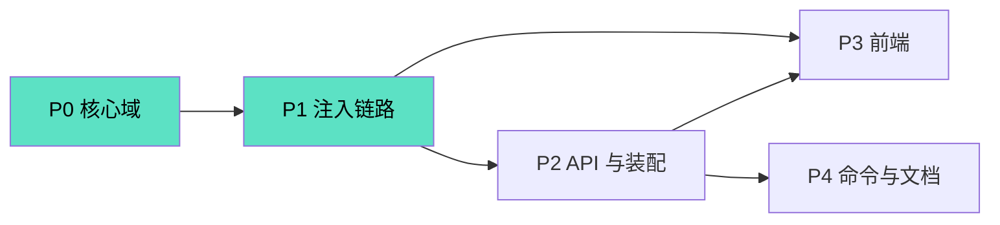
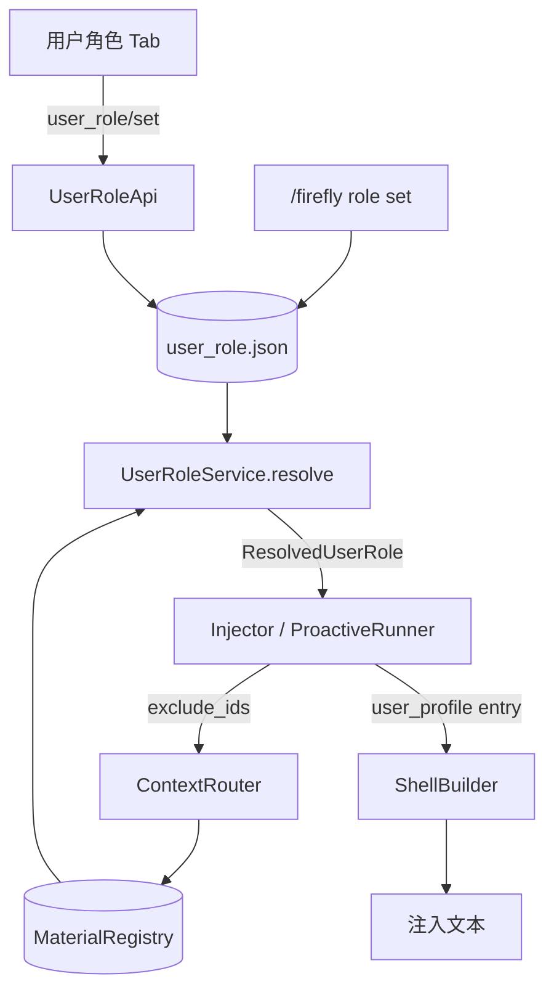

# 用户角色预设模块 · 开发计划

> 关联设计：`DESIGN_user_role.md`
> 本次范围：设计 §13 的 P0–P4 全量（core 域 → 注入链路 → API → 前端 → 命令）
> 状态：待评审 → 待实现
> 硬约束：只改 `data/plugins/astrbot_plugin_Firefly/`，主程序一行不改

---

## 0. 决策锁定与范围

### 0.1 已锁定决策（设计 §2）

| 编号 | 决策 | 对本计划的影响 |
|---|---|---|
| D1 | 身份是**独立维度**，不进 tier | 不修改既有资料的 tier/kind；只新增 `user_role` kind |
| D2 | 会话只存 `{mode, role_id}`，不存正文/路径 | Store 只持久化逻辑键；正文始终经 `registry.get(id)` 现取 |
| D3 | **复用** `人物关系/开拓者.md` | P0-0 必须先补齐该文件正文与 `id`；未补齐时只能降级 |
| D4 | 自定义文档放 `role/用户角色/`，永不进路由池 | Router 候选过滤 + `index_summary` 过滤是**必做项**，不是优化 |
| D5 | 独立 `data/user_role.json`，**不放 `SessionState`** | 与 `/firefly reset` 解耦；`UserRoleStore` 独立生命周期 |
| D6 | 新增 `<user_profile>` 常驻块 | `ShellBuilder` 增加不可裁剪层；引入正文长度上限 |
| D7 | 全局默认 + 会话覆盖 | Store 的 `default` 与 `sessions` 同构；API 用 `scope` 区分 |
| D8 | pin 的 id 从**会话级**路由候选排除 | `ContextRouter.route` 增加 `exclude_ids`，三个实现统一遵守 |

### 0.2 本次交付的能力

| 能力 | 是否交付 |
|---|---|
| 用户可选现有人物（默认开拓者）为身份 | ✅ P0+P1+P2+P3 |
| 用户可新建自定义角色文档并选为身份 | ✅ P3（复用 `role/save`）+ P2 |
| 身份作为会话级常驻、确定性注入 | ✅ P1 |
| pin 条目从路由去重，其余角色仍按需触发 | ✅ P1 |
| 全局默认 + 会话覆盖 | ✅ P0+P2 |
| 删除守卫纳入"正被 pin 的会话" | ✅ P2 |
| 按发送者（群内不同人不同身份） | ❌ 非目标（设计 §11.3） |

### 0.3 硬约束

1. 只改 `data/plugins/astrbot_plugin_Firefly/`，主程序一行不改。
2. `core/user_role/*`、`core/shell/*` 不 import astrbot / quart；`adapter/user_role_api.py` 只做 HTTP 薄层。
3. **不修改 `adapter/debug_api.py`**（保持只读语义）；不修改既有 `tests/` 的断言（只新增）。
4. 不移动、不改名、不改 tier 任何既有资料文件；`开拓者.md` 只补 frontmatter 与正文。
5. 解析失败**绝不允许中断外壳注入**：任何异常都必须降级为"无身份块 + 告警"。
6. 现有 `tests/` 全部保持绿色；前端不引入构建链。

---

## 1. 阶段性开发路线图

### 1.1 阶段总览

| 阶段 | 目标 | 依赖 | 可独立合并 | 规模 |
|---|---|---|---|---|
| **P0** | 核心域：`user_role` 四件套 + 常量 + registry 索引侧过滤 | 无 | ✅ | M |
| **P1** | 注入链路：`<user_profile>` 块 + 路由去重 + 三路径接入 | P0 | ✅ | L |
| **P2** | API 与装配：`user_role/*` 接口 + 删除守卫扩展 + `main.py` 装配 | P1 | ✅ | M |
| **P3** | 前端：独立「用户角色」Tab（两池单选 + 预览 + 新建/编辑/删除） | P1、P2 | ✅ | L |
| **P4** | 命令与文档：`/firefly role` + README | P2 | ✅ | S |

**排序理由**

- P0 是纯逻辑，零外部依赖、可单测，先落地把领域模型钉死，后续阶段只做"接线"。
- P1 是正确性的核心（身份必须确定性注入 + 不重复注入），必须在开放 API/UI 之前完成，否则面板能设置但注入不生效。
- P2 的删除守卫扩展依赖 P1 的 pin 可被 `UserRoleStore.all()` 读到。
- P3 与 P1/P2 文件不相交，但需 API 就绪才可联调；前端可在 P2 完成前先做静态骨架。
- P4 最薄，最后收口。

### 1.2 依赖关系



- 关键路径：`P0 → P1 → P2 → P3`。
- P4 只依赖 P2，可与 P3 并行。

---

## 2. 详细任务分解

> 每项注明：**目标 / 内容 / 涉及文件 / 依赖 / 验收**。

### 2.1 阶段 P0：核心域（纯逻辑，可单测）

#### P0-0（前置，阻塞 P0-3 默认值）补齐内置开拓者文档

- **目标**：让 `DEFAULT_USER_ROLE_ID` 能解析到非空正文。
- **内容**：给 `role/人物关系/开拓者.md` 补 frontmatter（`id: trailblazer`、`title: 开拓者`、`kind: lore`）与正文（该角色是谁、与流萤的关系、对话定位）。**不改变文件路径与目录**。
- **涉及文件**：`role/人物关系/开拓者.md`
- **依赖**：无
- **验收**：`registry.get("trailblazer")` 返回非空 `content`；`exclude_ids` 排除了它时，其它人物关系仍可路由。
- **降级**：若暂不补齐正文，解析器必须把"空正文"判为无效并告警（P0-4 的用例覆盖），功能不崩但默认身份块为空。

#### P0-1 常量与目录规则

- **目标**：集中定义身份模块的领域常量。
- **内容**：`core/consts.py` 追加 `KIND_USER_ROLE`、`DEFAULT_USER_ROLE_ID="trailblazer"`；`DIRECTORY_TIER_RULES` 追加 `("用户角色", TIER_SKILL_LORE, KIND_USER_ROLE)`。`SHELL_USER_PROFILE_TAG` 留到 P1-1 引入，`USER_ROLE_CUSTOM_DIR` 留到 P2-1 引入——常量只在其消费者所在阶段落地，P0 不携带未使用的定义。
- **涉及文件**：`core/consts.py`
- **依赖**：无
- **验收**：`infer_tier_kind("用户角色/我的角色.md")` 返回 `(3, "user_role")`；既有目录推断结果不变。

#### P0-2 领域模型

- **目标**：定义 `UserRoleSetting` / `ResolvedUserRole`，作为跨层契约。
- **内容**：新增 `core/user_role/models.py`，`frozen dataclass`，复用 `core/models.py` 的 `MaterialEntry`；含 `MODE_EXISTING`/`MODE_CUSTOM` 常量。
- **涉及文件**：新增 `core/user_role/models.py`
- **依赖**：无
- **验收**：`to_dict`/`from_dict`（若实现）round-trip 一致；`dataclass(frozen=True)` 不可变。

#### P0-3 设置仓库 `UserRoleStore`

- **目标**：持久化 `{version, default, sessions}`，提供同步读 + 异步写。
- **内容**：
  - 文件：`data/user_role.json`（由 `main.py` 用 `StarTools.get_data_dir` 定位）。
  - `load() -> list[str]`：损坏/非对象时告警并回退默认，**不清空**其它状态。
  - `get(session_id) -> UserRoleSetting`（内存读，**同步**，供注入热路径）。
  - `async set(session_id, setting)` / `async clear(session_id)` / `async set_default(setting)` / `default_setting()`。
  - `async all() -> dict[str, UserRoleSetting]`（供删除守卫）。
  - 写入用临时文件 + `os.replace` 原子替换 + `asyncio.Lock` 串行化（对齐 `StateStore.save`，`state.py:109`）。
  - `persist=False` 时仅内存（与 `StateStore` 语义一致）。
- **涉及文件**：新增 `core/user_role/store.py`
- **依赖**：P0-2
- **验收**：落盘 round-trip；并发 `set` 不产生半文件；写失败有日志。

#### P0-4 解析器 `UserRoleResolver`

- **目标**：`setting + registry → ResolvedUserRole`，纯函数、无 IO。
- **内容**：按设计 §6.2 实现：`normalize(mode)`、`valid(entry)=entry and not entry.is_empty()`、custom 失效回退默认、每条回退都带 `warning`。
- **涉及文件**：新增 `core/user_role/resolver.py`
- **依赖**：P0-1、P0-2
- **验收**：覆盖设计 §10 的 1/2/3/4 号边界（缺失、空正文、id 不存在、非法 mode）；解析永不抛异常。

#### P0-5 应用服务 `UserRoleService`

- **目标**：组合 store + resolver，给三条注入路径提供单一入口。
- **内容**：`resolve(session_id) -> ResolvedUserRole`（同步：仓库读与解析都不 await，默认 → 会话覆盖）；`setting(session_id)` 同步读。构造注入 `UserRoleStore` 与 `MaterialRegistry`。
- **涉及文件**：新增 `core/user_role/service.py`
- **依赖**：P0-3、P0-4
- **验收**：会话覆盖优先于默认；`exclude_ids` 辅助方法返回 `frozenset({pin_id})` 或空集。

#### P0-6 registry 索引侧过滤

- **目标**：身份文档不进 LLM 路由摘要（防跨会话泄露 + 省 token）。
- **内容**：`MaterialRegistry.index_summary()`（`registry.py:152`）跳过 `kind == KIND_USER_ROLE`；`all_entries()` 与 `get()` **保持包含**（解析与编辑器需要）。
- **涉及文件**：`core/materials/registry.py`
- **依赖**：P0-1
- **验收**：`index_summary()` 不含任何 `用户角色/` 条目；`registry.get("my_role")` 仍可命中。

#### P0-7 P0 测试

- **内容**：新增 `tests/test_user_role.py`（store / resolver / service）+ 扩展 registry 过滤断言。
- **验收**：见 §4.2 测试矩阵；`tests/test_architecture.py` 的分层断言对新模块同样成立。

---

### 2.2 阶段 P1：注入链路

#### P1-1 `<user_profile>` 注入块

- **目标**：把身份正文渲染为不可裁剪的常驻块。
- **内容**：
  - `core/consts.py` 增加 `SHELL_USER_PROFILE_TAG`（P0 刻意未携带，消费者在此引入）。
  - `core/shell/builder.py`：`build(..., user_profile: MaterialEntry | None = None)`；新增 `_build_user_profile()`；块序为 `static_core → user_profile → dynamic_state → active_context`。
  - 更新 `_SHELL_INTRO`（`builder.py:22`），说明 `<user_profile>` 描述"正在与你对话的人"。
  - 超长保护：超过 `user_profile_max_tokens` 时按字符边界截断 + 追加截断标记，并写入 `BuildResult` 告警来源。
- **涉及文件**：`core/shell/builder.py`、`core/models.py`（`BuildResult` 若需携带告警）
- **依赖**：P0-1
- **验收**：有身份时块存在且位置正确；无身份时块不出现且外壳其余部分不变；超限安全截断。

#### P1-2 配置项

- **目标**：暴露身份块预算。
- **内容**：`ShellConfig` 增加 `user_profile_max_tokens: int = 600`；`_conf_schema.json` 增加 `user_role.user_profile_max_tokens`（`custom_dir` 本期固定，不入 schema）；`ShellConfig.from_dict` 解析并钳制下限。
- **涉及文件**：`core/config.py`、`_conf_schema.json`
- **依赖**：无
- **验收**：配置解析有 `test_config.py` 风格的单测；脏值回退默认并告警。

#### P1-3 组装层接入

- **目标**：`ShellAssembly` 支持传入身份并过滤 pin 残留。
- **内容**：
- `ShellAssembly` 持有可选 `user_role_service` 并在 `build(state, max_tokens=None, resolved=None)` 内解析身份：`resolved` 由调用方传入时直接复用（避免重复解析），否则本层自行解析；随后把 `entry` 交给 builder，并用 `pin_id` 过滤激活对。
- `active_pairs(state, pin_id="")` 过滤 `entry_id == pin_id`。**身份解析放在 assembly 而非各调用方**：这样对话注入与主动消息走同一路径，身份块必然一致，且 `ProactiveRunner` 无需改动。
- 未注入 `user_role_service` 时等价"无身份"，保持既有 2 参调用与旧测试不回归。
- **涉及文件**：`core/shell/assembly.py`
- **依赖**：P1-1
- **验收**：`active_pairs` 不含 pin id；`build` 兼容既有 2 参调用（测试不回归）。

#### P1-4 路由去重（`exclude_ids`）

- **目标**：pin 条目不再被路由激活，且不占用 `max_on_demand`。
- **内容**：
  - `ContextRouter.route(..., exclude_ids=frozenset())`（`router.py:47` 协议扩展）。
  - `KeywordRouter` 候选过滤（`router.py:242`）+ `LLMRouter._parse_response` 有效 id 过滤（`router.py:181`）+ `FallbackRouter` 透传。
  - 默认参数保证既有调用方与测试无需改签名。
- **涉及文件**：`core/routing/router.py`
- **依赖**：无（可与 P1-1 并行）
- **验收**：三实现在 `exclude_ids` 下均不返回该 id；传空集时行为与现状逐位一致。

#### P1-5 Injector 两条路径接入

- **目标**：普通对话与任务路径都解析并注入身份。
- **内容**：
  - 构造注入 `UserRoleService`。
  - `_inject()`（`injector.py:188`）：在读取 `state` 后 `resolved = self._resolve_user_role(session_id)`；`route(..., exclude_ids=self._exclude_ids(resolved))`；`assembly.build(state, max_tokens, resolved=resolved)`。
  - `_inject_for_task()`（`injector.py:140`）：同样解析（任务路径也应知道对话者是谁）。
  - 解析失败/回退：记 debug 日志（含 `resolved.warning`），**不影响既有跳过原因记录**。
- **涉及文件**：`adapter/injector.py`
- **依赖**：P1-2、P1-3、P1-4、P0-5
- **验收**：设置 pin 后两类请求的注入文本均含 `<user_profile>`；解析失败时注入不中断。

#### P1-6 主动消息接入

- **目标**：她主动开口时同样带上身份认知。
- **内容**：无需改动 `ProactiveRunner`——身份解析已在 `ShellAssembly.build` 内完成（见 P1-3），主动消息调用 `assembly.build(state, max_tokens)` 时自动带上身份块。仅需在 `main.py` 装配时把同一 `user_role_service` 注入 `ShellAssembly`。
- **涉及文件**：`adapter/proactive_runner.py`
- **依赖**：P1-3、P0-5
- **验收**：主动消息的注入文本含 `<user_profile>`；无 pin 时行为与现状一致（`test_proactive_runner.py` 不回归）。

#### P1-7 P1 测试

- **内容**：builder 块与截断、assembly 过滤、router 三实现、injector/proactive 集成。
- **验收**：见 §4.2。

---

### 2.3 阶段 P2：API 与装配

#### P2-1 `UserRoleApi`

- **目标**：提供面板读写身份的 HTTP 契约（设计 §8）。
- **内容**：新增 `adapter/user_role_api.py`，`register_routes()` 注册：
  - `core/consts.py` 增加 `USER_ROLE_CUSTOM_DIR`（P0 刻意未携带，消费者在此引入）。
  - 按需在 `UserRoleService` 补 `set_session`/`clear_session`/`set_default`/`session_setting` 转发（P0 刻意不提供无人调用的转发面）。
  - `GET  user_role/get`：默认 + 会话设置、`resolved`（含真实 `body`）、`candidates.existing`（`人物关系/` 前缀）/`candidates.custom`（`用户角色/` 前缀），候选来自 `RoleStore.list_tree`，带 `empty` 标记。
  - `POST user_role/set`：`{scope, session?, mode, role_id}`；**先解析校验，无效则拒绝写入**。校验判据是"直接命中"（`origin ∈ {existing, custom}`）而非 `has_entry`——否则自定义失效回退到内置默认会被误判为合法；`scope=default` 且 `mode=existing` 且 `role_id=""` 作为哨兵豁免。
  - `UserRoleService` 相应补齐 `default_setting` / `session_setting` / `resolve_setting` / **`validate_setting`**（写前校验，API 与命令共用的唯一判定）与 `set_session` / `clear_session` / `set_default`。
  - `POST user_role/reset`：清除会话覆盖或重置默认。
  - HTTP 参数提取复用 `HttpHelpers`（`adapter/api/http.py`）；写路径不直接碰文件，只操作 `UserRoleService`/`UserRoleStore`。
- **涉及文件**：新增 `adapter/user_role_api.py`
- **依赖**：P1
- **验收**：三个接口的入参/出参与设计 §8 一致；非法 id 返回明确错误。

#### P2-2 删除守卫扩展

- **目标**：删除正被 pin 的身份文档时给出提示。
- **内容**：`RoleApi._usage_map()`（`role_api.py:195`）在 `active_context` 之外，合并会话级覆盖中 `role_id == entry_id` 的会话；全局默认身份命中时追加占位标记 `（全局默认身份）`；`_active_session_ids()`（`role_api.py:209`）据此返回。**沿用既有 `active_sessions` / `active_session_ids` 字段（合并计数），不新增来源字段**，保持前端与既有断言兼容。
- **涉及文件**：`adapter/role_api.py`（构造新增 `user_role_store`）
- **依赖**：P0-3
- **验收**：pin 某文档后删除它，接口返回需要二次确认，并列出会话 id；`tests/test_role_api.py` 不回归。

#### P2-3 `main.py` 装配

- **目标**：构造并登记新组件，管理生命周期。
- **内容**：
  - `UserRoleStore(data_dir/"user_role.json", persist=cfg.persist_state, logger=...)`；`initialize()` 中 `await store.load()` 并记录告警。
  - `UserRoleService(store, registry)`；注入 `CognitiveShellInjector`、`ProactiveRunner`、`UserRoleApi`、`RoleApi`。
  - `terminate()` 中 `await user_role_store.close()` 最终落盘。
  - `FireflyCore` 登记 `user_role_store` / `user_role_service`（供命令与面板读取）。**P1/P2 期间命令尚未消费，为满足架构护栏"死字段"断言，登记推迟到 P4-1 与命令一起落地**。
- **涉及文件**：`main.py`
- **依赖**：P0、P1
- **验收**：插件启动/停止无异常；`/firefly status` 可显示当前默认身份（可选）。

#### P2-4 P2 测试

- **内容**：`tests/test_user_role_api.py`（接口契约 + 校验拒绝 + scope 语义）+ 删除守卫用例。
- **验收**：见 §4.3。

---

### 2.4 阶段 P3：前端「用户角色」Tab

> 复用 `PLAN_ui_role_editor.md` 已规划/已实现的 `modules/dom.js`、`api-client.js`、编辑器组件；本阶段只新增视图与 Tab。

#### P3-1 Tab 注册

- **目标**：新增独立 Tab。
- **内容**：`pages/dashboard/index.html` 加 Tab 容器；`app.js` 注册 `{ id: "user-role", label: "用户角色", mount, refresh }`。
- **涉及文件**：`pages/dashboard/index.html`、`pages/dashboard/app.js`
- **依赖**：P2
- **验收**：Tab 可切换；懒加载，不拖慢首屏。

#### P3-2 两栏视图与二选一单选

- **目标**：左栏两池单选 + 右栏只读预览。
- **内容**：新增 `pages/dashboard/views/user-role.js`：
  - 顶部状态条：当前身份 + "常驻注入，已从按需路由排除"。
  - 左栏：`(○) 现有角色` / `(○) 自定义角色` 单选组 + 搜索；候选由 `user_role/get` 返回的 `candidates` 渲染；`empty` 项禁用并标注。
  - 右栏：候选真实正文只读渲染（`modules/markdown.js`）；「设为当前身份」按钮。
  - 点击候选只更新预览；正文经 `role/file` 现取（与运行时同源），确认后才调用 `user_role/set`。
  - 实现修正：面板编辑的是**全局默认**（`scope=default`），会话级覆盖由 P4 命令负责；因此视图无需请求会话 id。
- **涉及文件**：新增 `pages/dashboard/views/user-role.js`、`pages/dashboard/styles.css`（必要的少量类）
- **依赖**：P3-1
- **验收**：选择→确认→顶部状态刷新；刷新页面后设置保持。

#### P3-3 新建 / 编辑 / 删除

- **目标**：自定义角色全生命周期。
- **内容**：
  - 「新建自定义角色」弹窗：名称、`id`（默认取名称，客户端先校验，服务端 `role/save` 再查重）、正文（非空）。
  - 保存走 `role/save`（`create: true`）→ 成功后自动 `user_role/set` 为新身份。
  - 编辑用弹窗：文件名与 `id` **只读**（改名会改变派生 id、解除绑定），仅正文可改；带 `base_rev` 乐观锁。
  - 删除：`role/tree` 取 `rev` 与引用方（含身份 pin）；被引用时需勾选确认，删除的是当前身份则回退内置默认。
- **实现修正**：编辑采用模态弹窗而非复用资料编辑器——本视图没有常驻草稿态，因此不需要 `beforeunload` / 切换拦截；
  改名因会解除身份绑定而**直接不提供**（需要改路径请到「资料浏览」操作）。
- **涉及文件**：`pages/dashboard/views/user-role.js`、`pages/dashboard/modules/dom.js`
- **依赖**：P3-2、P2-1
- **验收**：新建→自动选中→预览正确；空正文/重名被拦截；删除有守卫提示。

#### P3-4 `modules/dom.js` 弹窗能力扩展

- **内容**：`formDialog` 增加 `textarea` 与 `readonly` 支持（新建/编辑角色需要多行正文与只读的 id/文件名）。
- **涉及文件**：`pages/dashboard/modules/dom.js`
- **依赖**：无
- **验收**：多行正文可编辑；只读字段不可改；Enter 提交不会在 textarea 内误触发。

> 实现修正：不新增 `api-client.js` 的 `userRole*` 薄封装——现有 `FireflyApi.get/post` 已是通用客户端，
> 与 `views/materials.js` 的用法一致，再包一层属无谓抽象。视图直接调用 `user_role/get|set`、`role/file`、`role/tree`、`role/save`、`role/delete`。

#### P3-5 前端手工清单

- **验收**：见 §4.4。

---

### 2.5 阶段 P4：命令与文档

#### P4-1 `/firefly role` 命令

- **目标**：会话级便捷入口（管理员）。
- **内容**：`adapter/commands.py` 增加 `role` 子命令，全部 `PermissionType.ADMIN`：
  - `status`（默认动作）：显示全局默认 / 本会话覆盖 / 实际注入；
  - `set existing [id]`：会话身份设为现有人物（省略 id = 内置默认哨兵）；
  - `set custom <id>`：会话身份设为自定义角色（id 必填）；
  - `clear`：清除会话覆盖。
  - 写入走 `UserRoleService.set_session`（不直接操作 store）；校验复用 `UserRoleService.validate_setting`。
- **实现修正**：原先设想的单一 `set <mode> [id]` 语义在"只写 id 不写 mode"时容易把 id 当成 mode，故拆成 `set existing|custom` 两个明确形态。
- **涉及文件**：`adapter/commands.py`、`main.py`（`FireflyCore` 登记身份组件）
- **依赖**：P2-3
- **验收**：命令设置后下一轮注入生效；`clear` 回落到默认；`tests/test_commands.py` 覆盖各分支。

#### P4-2 文档增补

- **内容**：`README.md` 补「用户角色预设」一节：两个池子、pin 语义、id 规则、与"开拓者不废弃"的说明。
- **涉及文件**：`README.md`
- **依赖**：P4-1
- **验收**：新用户读完能理解"选择=pin，不等于替换/删除文档"。

---

## 3. 架构与修改清单

### 3.1 分层与职责（单一职责，互不越界）

| 组件 | 唯一职责 | 明确不做 |
|---|---|---|
| `UserRoleStore`（新） | 持久化 `{default, sessions}`；同步读/异步写/原子落盘 | 不认识 registry、不做解析、不生成文本 |
| `UserRoleResolver`（新） | `setting + registry → ResolvedUserRole`（纯函数） | 不读盘/写盘、不管 HTTP、不认识 session |
| `UserRoleService`（新） | 组合 store + resolver，暴露 `resolve(session_id)` | 不做 IO 细节、不拼 XML |
| `ShellBuilder`（改） | 渲染 `<user_profile>` 块 + 截断保护 | 不解析身份、不管 pin、不查路由 |
| `ShellAssembly`（改） | 组装三层/四层块，过滤 pin 残留 | 不解析身份（由调用方传 entry） |
| `ContextRouter`（改） | 按 `exclude_ids` 约束选资料 | 不知道 exclude 语义来自用户角色 |
| `MaterialRegistry`（改） | 索引；`index_summary` 排除 `user_role` | 不知道"身份"概念 |
| `Injector` / `ProactiveRunner`（改） | 编排：resolve → route → build → inject | 不自行解析 id、不自行拼块 |
| `UserRoleApi`（新） | HTTP 契约 `get/set/reset` | 不直接改文件、不碰 store 内部结构 |
| `RoleApi`（改） | 删除守卫纳入 pin 会话 | 不承担身份设置读写 |

依赖方向：`adapter → core`；`core.user_role → core.models / core.materials`；`core.shell → core.models`。**无反向依赖、无循环。**

### 3.2 修改清单

| 文件 | 操作 | 归属阶段 |
|---|---|---|
| `core/consts.py` | 改（追加常量与目录规则） | P0-1 |
| `core/user_role/models.py` | 新增 | P0-2 |
| `core/user_role/store.py` | 新增 | P0-3 |
| `core/user_role/resolver.py` | 新增 | P0-4 |
| `core/user_role/service.py` | 新增 | P0-5 |
| `core/materials/registry.py` | 改（`index_summary` 过滤） | P0-6 |
| `core/shell/builder.py` | 改（`<user_profile>` + 截断） | P1-1 |
| `core/config.py` / `_conf_schema.json` | 改（`user_profile_max_tokens`） | P1-2 |
| `core/shell/assembly.py` | 改（身份入参 + pin 过滤） | P1-3 |
| `core/routing/router.py` | 改（`exclude_ids`） | P1-4 |
| `adapter/injector.py` | 改（两条路径接入） | P1-5 |
| `adapter/proactive_runner.py` | 改（接入身份） | P1-6 |
| `adapter/user_role_api.py` | 新增 | P2-1 |
| `adapter/role_api.py` | 改（删除守卫纳入 pin） | P2-2 |
| `main.py` | 改（装配 + 生命周期） | P2-3 |
| `pages/dashboard/{index.html,app.js}` | 改（新 Tab） | P3-1 |
| `pages/dashboard/views/user-role.js` | 新增 | P3-2/3 |
| `pages/dashboard/modules/dom.js` | 改（`formDialog` 支持 textarea / readonly） | P3-4 |
| `adapter/commands.py` | 改（`/firefly role`） | P4-1 |
| `tests/test_commands.py` | 新增（命令分支冒烟） | P4-1 |
| `role/人物关系/开拓者.md` | 改（补 frontmatter + 正文） | P0-0 |
| `tests/test_user_role.py` 等 | 新增 | P0-7/P1-7/P2-4 |

### 3.3 数据流



### 3.4 关键设计决策（实现层面）

- **热路径同步读**：`UserRoleStore.get` 为内存同步读（注入每轮调用，不能 await 排队）；写为异步并整体落盘。
- **正文永远现取**：Store 不缓存正文，`resolve` 经 `registry.get(id)` 触发懒加载，改文件下轮生效。
- **`exclude_ids` 默认空集**：协议扩展对既有调用方零影响，降低回归面。
- **块不可裁剪**：身份缺失会让整段对话失焦，优先级高于 `<active_context>`；只在超过自身上限时截断自身。
- **两条池子按 kind 而非目录过滤**：`kind == user_role` 是稳定判据；即使文件被误放到 `人物关系/`，行为也可预期。

---

## 4. 测试与验证计划

### 4.1 边界条件 → 用例映射（严谨性核心）

下表把设计 §10 的每条边界落到**具体测试用例**，要求逐条有断言，不接受"人工看过"。

| 设计# | 场景 | 用例（`tests/test_user_role.py` 等） | 断言 |
|---|---|---|---|
| 1 | 身份文档被删除 | `test_resolve_custom_missing_falls_back` | `origin=="fallback"`、`warning` 非空、`pin_id==DEFAULT` |
| 2 | 正文为空 | `test_resolve_empty_body_invalid` | `valid()` 为假 → 回退；候选 `empty=True` |
| 3 | `role_id` 不存在 | `test_resolve_unknown_id` / `test_api_set_rejects_unknown_id` | 解析 `origin=="none"`；API 返回 error，**不写盘** |
| 4 | 非法 `mode` | `test_normalize_invalid_mode` | 归一化为 `existing` 且 warning |
| 5 | `id` 冲突 | `test_api_set_rejects_ambiguous_id`（基于 `role/tree` 的 `duplicate_id`） | 拒绝写入 |
| 6 | 自定义误放可路由池 | `test_router_excludes_user_role_kind` | `user_role` 不进候选；误放者按普通 lore 处理 |
| 7 | pin 残留在 `active_context` | `test_assembly_active_pairs_filters_pin` | 输出不含 `pin_id` |
| 8 | 切换身份立即生效 | `test_resolve_reflects_store_change` | 第二次 `resolve` 用新值 |
| 9 | `/firefly reset` 不清 pin | `test_reset_state_keeps_user_role` | reset 后 store 中 setting 不变 |
| 10 | 陈旧清理不影响身份 | `test_user_role_not_decayed` | `is_stale` 逻辑不触及 store |
| 11 | 群聊共享会话级 pin | `test_session_scoped_pin` | A/B 会话互不影响；A 的 exclude 不影响 B |
| 12 | 非管理员 | 命令层 `permission_type(ADMIN)` 声明（手工/静态检查） | 装饰器存在 |
| 13 | 并发写 | `test_store_concurrent_set_atomic` | 结果文件合法 JSON，无半文件 |
| 14 | `user_role.json` 损坏 | `test_store_load_corrupt_falls_back` | 告警 + 默认设置；不抛异常 |
| 15 | 正文超长 | `test_builder_user_profile_truncated` | 长度 ≤ 上限 + 截断标记 |
| 16 | `用户角色/` 不存在 | `test_candidates_empty_when_dir_missing` | 返回空列表，不报错 |
| 17 | 停用落盘 | `test_store_close_persists` | `close()` 后文件含最新值 |
| 18 | 旧版无 `register_web_api` | `test_api_register_noop_without_hook` | 不抛异常、无路由注册 |

### 4.2 P0/P1 测试矩阵

**Store**

- 默认初始化（无文件）→ `default == {existing, ""}`。
- `set(session)` / `set_default` / `clear` 落盘 round-trip。
- `persist=False` 不写盘。
- 原子性：写过程中断不产生半文件（`tmp` + `os.replace` 验证）。
- 并发 `set`：`asyncio.gather` 后文件合法。

**Resolver**

- existing + 默认 id 命中；existing + 显式 id；custom 命中。
- custom 缺失 → fallback；空正文 → invalid；非法 mode → normalize。
- `valid()` 对 `content=None`（未懒加载）与 `content=""` 的判定（**必须在 resolve 前触发 `get` 的懒加载**，否则会误判为空——这是实现红线，需用例锁定）。

**Registry 过滤**

- `index_summary()` 不含 `user_role`；`all_entries()` 含。
- `infer_tier_kind("用户角色/x.md") == (3, "user_role")`。

**Router**

- `KeywordRouter`：pin id 命中关键词也不返回。
- `LLMRouter._parse_response`：模型返回 pin id 时被过滤。
- `FallbackRouter`：透传 `exclude_ids`；空集时与现状逐位一致。

**Builder / Assembly**

- 有/无 `user_profile` 的块结构；顺序正确。
- 不可裁剪：总预算不足时先裁 `<active_context>`，`static_core` 与 `user_profile` 都在。
- `user_profile_max_tokens` 截断 + 截断标记 + 告警。
- `active_pairs` 过滤 pin。

**Injector / ProactiveRunner（集成）**

- 设置 pin 后 `on_llm_request` 注入文本含 `<user_profile>`。
- 解析失败（删文件）→ 外壳其余部分照常注入，无异常抛出。
- 任务路径（`_inject_for_task`）含身份块。
- 主动消息注入含身份块。

### 4.3 P2 测试矩阵

- `user_role/get`：无设置时返回默认；有会话覆盖时两者都返回；`resolved.body` 与 `registry.get` 一致。
- `user_role/set`：`scope` 两态；非法 id/空正文被拒且**不落盘**；`existing + ""` 合法。
- `user_role/reset`：会话 → 回落默认；默认 → 重置。
- 删除守卫：pin 后 `role/delete` 返回需确认并列出会话；未 pin 时不误报。
- 回归：`tests/test_role_api.py` 全绿（守卫计数语义变化需同步更新既有断言——若冲突，保留旧字段并新增来源字段，避免破坏）。

### 4.4 P3 前端手工清单

- Tab 切换、懒加载。
- 两池单选；点击候选→预览；确认→状态条刷新。
- 新建：名称生成路径、`id` 实时查重、空正文拦截；保存后自动 pin。
- 编辑：`base_rev` 冲突横幅；改名改 `id` 时出现解绑提示。
- 删除 pin 文档：二次确认 + 回退提示。
- 未保存切换拦截（页面关闭 + Tab 切换）。
- 明/暗主题下可读；无 `onclick` 字符串注入。

### 4.5 验证手段

```bash
# 后端
uv run pytest tests/test_user_role.py -q
uv run pytest tests/test_role_api.py tests/test_injector.py tests/test_builder.py \
  tests/test_matcher.py tests/test_config.py tests/test_architecture.py -q
uv run pytest tests/ -q          # 全量回归
ruff format . ; ruff check .
```

前端无测试框架，按 §4.4 手工清单执行。

---

## 5. 交付验收标准

1. 设置 pin 后，普通对话 / 任务路径 / 主动消息三种注入均含 `<user_profile>`，内容 = pin 文档正文。
2. pin 的 id 不再出现于该会话的 `<active_context>`；**其他会话**对同一文档的按需触发不受影响。
3. `role/用户角色/` 下文档不出现在 `index_summary()`，也不被关键词/LLM 路由选中。
4. 选自定义角色时，`人物关系/开拓者.md` 仍能按需触发（用例锁定）。
5. 删除 / 改名 / 清空正文 / 损坏 JSON 等异常下，外壳注入永不中断，均有告警。
6. 删除守卫能识别"正被 pin 的会话"。
7. `/firefly reset` 不清除身份设置。
8. `tests/` 全量绿色；`ruff format` / `ruff check` 无新增告警。
9. 仅 `data/plugins/astrbot_plugin_Firefly/` 内变更，主程序未改。

---

## 6. 风险与回退

| 风险 | 影响 | 对策 / 回退 |
|---|---|---|
| 内置开拓者文档长期为空 | 默认身份块为空 | P0-0 补齐；解析器将空正文判无效并告警，不影响其余功能 |
| `ContextRouter` 协议扩展引发回归 | 路由测试失败 | `exclude_ids` 默认空集；先合 P1-4 并跑全量路由测试，再接入 injector |
| 身份块挤占 token 预算 | 按需资料被裁 | 不可裁剪但设上限；超限截断自身并告警，必要时调高 `max_tokens` |
| `registry.get` 懒加载与 `is_empty()` 判空时序 | 误判有效身份为空 | 解析器**先 get 触发懒加载再判空**，用例锁定 |
| 删除守卫语义变更破坏既有前端 | 删除流程异常 | 保留 `active_sessions` 计数，新增来源字段；前端可渐进适配 |
| `user_role.json` 与 Dashboard 配置双源 | 用户困惑 | 明确 `user_role.json` 为唯一来源，配置只放上限 |
| 群聊身份语义模糊 | 用户预期偏差 | 文档明示会话级；不做按 sender（非目标） |
| 前端 `role/save` 与 `user_role/set` 两步失败 | 文档建了但未选中 | 前端可重试 `set`；后端幂等 |

**整体回退**：本模块可整体关闭而不影响既有能力——`resolve` 返回 `origin="none"`（无 pin）时，`<user_profile>` 不出现、`exclude_ids` 为空，行为与现状逐位一致。因此按阶段合并，任阶段出问题可只回退该阶段。

---

## 7. 提交规划（建议）

按阶段拆分，消息用 conventional commits：

1. `feat(user-role): add user role domain (models/store/resolver/service)`
2. `feat(user-role): exclude user_role kind from index summary`
3. `feat(user-role): inject <user_profile> block into shell`
4. `feat(user-role): exclude pinned id from context routing`
5. `feat(user-role): wire user role into injector and proactive runner`
6. `feat(user-role): add user_role web api and delete guard`
7. `feat(user-role): add dashboard user role tab`
8. `feat(user-role): add /firefly role command and docs`
9. `chore(user-role): seed built-in trailblazer profile`（如与 P0 拆开）

每个提交都必须：`ruff format .` + `ruff check .` + 相关测试子集通过。

---

## 8. 后续观察项（不在本次范围）

- 按发送者的用户级身份（群聊内不同人不同身份）。
- 身份文档的版本/切换历史。
- 身份与其他资料（如关系阶段）的联动。
- 面板对 `自定义角色` 的 Markdown 富文本预览（依赖 `PLAN_ui_role_editor.md` P3）。
- 多身份快速切换（同一会话多个预设并快捷切换）。

---

## 9. 一句话总结

> 以 `UserRoleService` 为唯一入口、`<user_profile>` 为唯一注入形态、`exclude_ids` 为唯一去重手段，
> 按 P0（纯逻辑）→ P1（注入链路）→ P2（API/装配）→ P3（前端）→ P4（命令）推进；
> 每阶段独立可合并、可回退，18 条边界全部落到具体断言，保证"选身份=pin，开拓者永不废弃，异常永不中断注入"。
